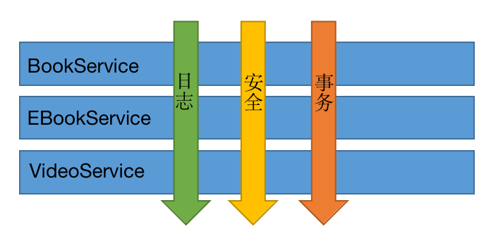
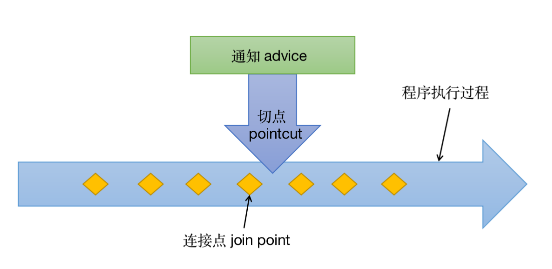
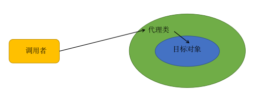
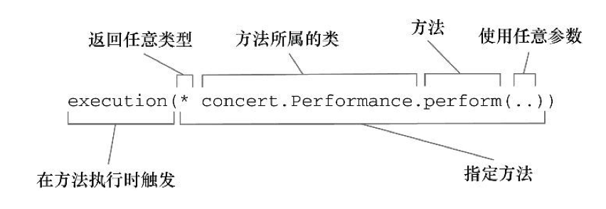
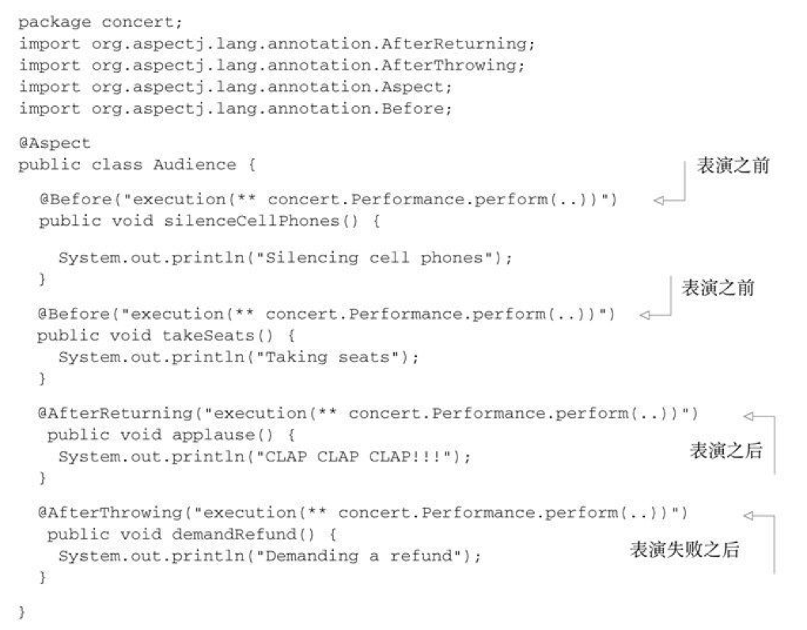
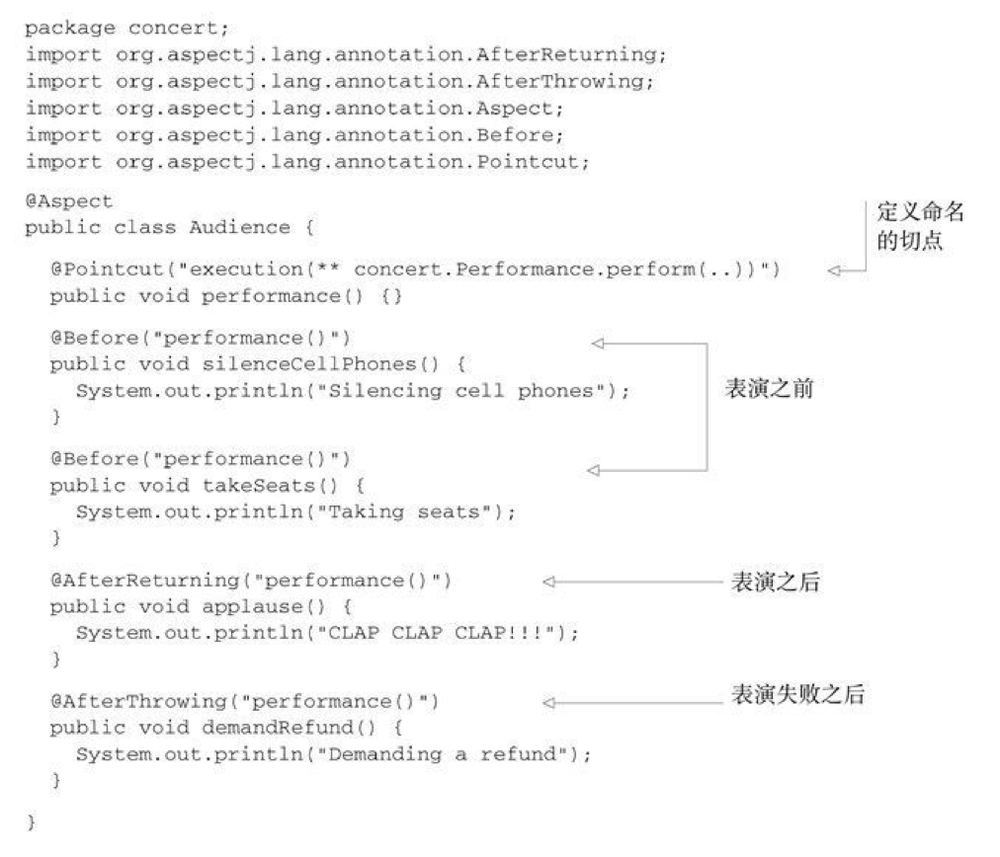
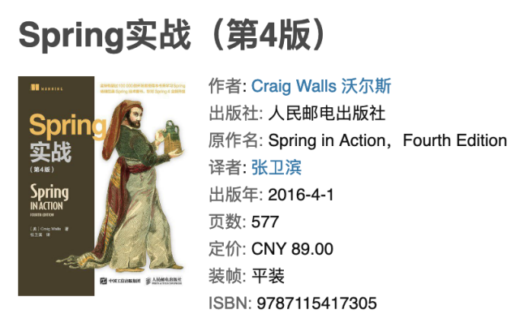

> AOP 被认为是对 OOP 的一个强大的补充，有了 AOP，我们可以把之前分散在应用各处的行为放在可重用的模块中，可以有效减少冗余代码，并让我们的类只关注自身的主要功能。


## AOP 概述

面向切面编程（aspect-oriented programming），是一种将横切关注点与业务逻辑分离的编程方式。每个横切关注点都集中在一个地方，而不是分散在多处代码中。这样使我们的服务模块更加简洁，因为它们只包含了主要关注点的代码，而次要的功能或者说辅助的功能被转移到切面中了。

 

上图表示划分为三个服务模块的应用，每个模块提供相应的服务，而且这些模块都需要类似的辅助功能，例如日志、安全、事务等等。我们并不想在各个模块中写重复的日志、安全、事务的代码，那么就可以使用选用切面这个方案，来解决这个问题。

## AOP 术语



- `advice` - 通知

  - > 切面的具体行为，即要切入执行的代码

- `pointcut` - 切点

  - > 通知被应用的具体位置

- `join point` - 连接点

  - > 程序运行时，能够应用通知的所有点

- `aspect` - 切面

  - > 什么时候在什么地方做什么事情，是切点和通知的结合

- `target` - 目标对象

  - > 被切入功能的目标对象

- `introduction` - 引入

  - > 将新的方法或属性引入到现有的类中

- `weaving` - 织入

  - > 把切面应用到目标对象并创建新的代理对象的过程

## 代理模式

代理模式是使用代理对象完成用户请求，屏蔽用户对真实对象访问的一种设计模式。现实生活中，代理人被授权执行当事人的一些事宜，无需当事人出面，从第三方的角度看，他只和代理人通信。而事实上代理人是要有当事人的授权，并且在核心问题上还需要请示当事人。

AOP 就是使用代理模式实现的，其中的代理类就相当于AOP中的切面。



### 静态代理

之所以称为静态代理，是因为在程序运行前，代理类就已经存在了。

**举个例子**

一般艺人都需要助理，来帮他跑腿，演出前谈价格，演出后收钱，只有表演的时候艺人才亲自出马。

1. 定义一个艺人接口

   ```java
   package org.nocoder.proxy.staticproxy;
   
   /**
    * 艺人接口
    * @author jason
    * @date 2019/2/14.
    */
   public interface Artist {
       /**
        * 表演
        */
       void perform();
   }
   ```

2. 定义艺人实现类刘德华

   ```java
   package org.nocoder.proxy.staticproxy;
   
   /**
    * 艺人刘德华
    *
    * @author jason
    * @date 2019/2/14.
    */
   public class LiuDehua implements Artist {
   
       private LiuDehua() {
       }
   
       public static LiuDehua getInstance() {
           return new LiuDehua();
       }
   
       public void perform() {
           System.out.println("刘德华出场演唱笨小孩...");
       }
   }
   ```

3. 编写代理类

   ```java
   package org.nocoder.proxy.staticproxy;
   
   /**
    * 艺人助理（代理类）
    *
    * @author jason
    * @date 2019/2/14.
    */
   public class ArtistProxy implements Artist {
   
       private LiuDehua liuDehua;
   
       private ArtistProxy() {
       }
   
       public ArtistProxy(LiuDehua liuDehua) {
           this.liuDehua = liuDehua;
       }
   
   
       public void perform() {
           System.out.println("助理出面谈价格，签合同...");
           liuDehua.perform();
           System.out.println("助理出面收钱...");
       }
   }
   ```

4. 运行`main`方法，将艺人实例传入代理类的构造方法，然后调用代理类的`perform()`

   ```java
   package org.nocoder.proxy.staticproxy;
   
   /**
    * @author jason
    * @date 2019/2/14.
    */
   public class StaticProxyDemo {
   
       public static void main(String[] args) {
           LiuDehua liuDehua = LiuDehua.getInstance();
           ArtistProxy proxy = new ArtistProxy(liuDehua);
           proxy.perform();
       }
   }
   ```

5. 运行结果

   ```java
   助理出面谈价格，签合同...
   刘德华出场演唱笨小孩...
   助理出面收钱...
   
   Process finished with exit code 0
   ```

**静态代理的缺点**

假设主题接口中的方法很多，为每一个接口写一个代理方法也很麻烦。如果接口有变动，则真实主题和代理类都要修改，不利于系统维护；

### 动态代理

动态代理是在程序运行时，利用Java反射机制动态的生成代理类的代理模式。

#### Jdk动态代理

- JDK的动态代理依靠接口实现
- 如果类并没有实现接口，则不能使用Jdk的动态代理


1. 定义图书服务接口

   ```java
   package org.nocoder.proxy.jdkproxy;
   
   /**
    * 图书服务接口
    * @author jason
    * @date 2019/2/14.
    */
   public interface BookService {
       /**
        * 新增图书接口
        */
       void addBook();
   }
   ```

   

2. 编写图书服务实现类

   ```java
   package org.nocoder.proxy.jdkproxy;
   
   /**
    * 图书服务实现类
    * @author jason
    * @date 2019/2/14.
    */
   public class BookServiceImpl implements BookService {
       @Override
       public void addBook() {
           System.out.println("新增图书");
       }
   }
   ```

3. 编写InvocationHandler实现类

   ```java
   package org.nocoder.proxy.jdkproxy;
   
   import java.lang.reflect.InvocationHandler;
   import java.lang.reflect.Method;
   
   /**
    * JDK 动态代理
    * @author jason
    * @date 2019/2/14.
    */
   public class BookServiceInvocationHandler implements InvocationHandler {
   
       private Object target;
   
   
       public BookServiceInvocationHandler(Object target){
           this.target = target;
       }
   
       @Override
       public Object invoke(Object proxy, Method method, Object[] args) throws Throwable {
           System.out.println("事务开始");
           Object result = method.invoke(target, args);
           System.out.println("事务结束");
           return result;
       }
   }	
   ```

4. 运行测试程序

   ```java
   package org.nocoder.proxy.jdkproxy;
   
   import java.lang.reflect.Proxy;
   
   /**
    * JDK动态代理演示
    *
    * @author jason
    * @date 2019/2/14.
    */
   public class JdkProxyDemo {
       public static void main(String[] args) {
           BookServiceInvocationHandler invocationHandler = new BookServiceInvocationHandler(new BookServiceImpl());
   
           // JDK 动态代理只支持接口
           BookService bookServiceProxy = (BookService) Proxy.newProxyInstance(
                   BookServiceImpl.class.getClassLoader(),
                   BookServiceImpl.class.getInterfaces(),
                   invocationHandler);
   
           bookServiceProxy.addBook();
       }
   }
   ```

5. 运行结果

   ```java
   事务开始
   新增图书
   事务结束
   
   Process finished with exit code 0
   ```

   

#### CGLIB动态代理

JDK的动态代理依靠接口实现，如果有些类并没有实现接口，则不能使用JDK代理，这时就要使用cglib动态代理了。使用cglib需要依赖`cglib`的jar，使用maven为例

```xml
<dependency>
  <groupId>cglib</groupId>
  <artifactId>cglib-nodep</artifactId>
  <version>3.2.4</version>
</dependency>
```

1. 定义图书服务类

   ```java
   package org.nocoder.proxy.cglibproxy;
   
   /**
    * @author jason
    * @date 2019/2/14.
    */
   public class BookService {
       public void addBook() {
           System.out.println("新增图书");
       }
   }
   ```

   

2. 编写MethodInterceptor实现类

   ```java
   package org.nocoder.proxy.cglibproxy;
   
   import net.sf.cglib.proxy.MethodInterceptor;
   import net.sf.cglib.proxy.MethodProxy;
   import java.lang.reflect.Method;
   
   /**
    * @author jason
    * @date 2019/2/14.
    */
   public class BookServiceMethodInterceptor implements MethodInterceptor {
   
       @Override
       public Object intercept(Object o, Method method, Object[] objects, MethodProxy methodProxy) throws Throwable {
           System.out.println("事务开始");
           methodProxy.invokeSuper(o, objects);
           System.out.println("事务结束");
           return null;
       }
   }
   ```

   

3. 运行测试程序

   ```java
   package org.nocoder.proxy.cglibproxy;
   
   import net.sf.cglib.proxy.Enhancer;
   
   /**
    * @author jason
    * @date 2019/2/14.
    */
   public class CglibProxyDemo {
       public static void main(String[] args) {
           BookServiceMethodInterceptor cglibInterceptor = new BookServiceMethodInterceptor();
           //cglib 强化剂
           Enhancer enhancer = new Enhancer();
           enhancer.setSuperclass(BookService.class);
           // 创建代理对象
           enhancer.setCallback(cglibInterceptor);
           BookService bookServiceProxy = (BookService)enhancer.create();
           bookServiceProxy.addBook();
       }
   }
   ```

   

4. 运行结果

   ```shell
   事务开始
   新增图书
   事务结束
   
   Process finished with exit code 0
   ```

## Spring AOP

Spring 提供了4中 aop 的支持，基于代理的经典SpringAOP，纯POJO切面，@Aspect注解驱动的切面，注入式AspectJ切面。前三种都是SpringAOP实现的变体，SpringAOP构建在动态代理基础之上，因此，Spring对AOP的支持局限于方法拦截。第四种实际是使用AspectJ的解决方案。提供了SpringAOP所不能支持的许多类型的切点。我们可以借助Spring的依赖注入把bean装配进AspectJ切面中。Spring借鉴了AspectJ的切面，以提供注解驱动的AOP。本质上，它依然是Spring基于代理的AOP。

#### 使用`@Aspect`创建切面类

Audience类使用`@Aspect`注解进行了标注。该注解表明Audience不仅仅是一个POJO，还是一个切面。Audience类中的方法都使用注解来定义切面的具体行为。Audience有四个方法，定义了一个观众在观看演出时可能会做的事情。在演出之前，观众要就坐（takeSeats()）并将手机调至静音状态（silenceCellPhones()）。如果演出很精彩的话，观众应该会鼓掌喝彩（applause()）。不过，如果演出没有达到观众预期的话，观众会要求退款（demandRefund()）。





#### Advice的5种注解

| **注解**        | **通知**                               |
| --------------- | :------------------------------------- |
| @After          | 通知方法会在目标方法返回或抛异常后调用 |
| @AfterReturning | 通知方法会在目标方法返回后调用         |
| @AfterThrowing  | 通知方法会在目标方法抛异常后调用       |
| @Around         | 通知方法会将目标方法封装起来           |
| @Before         | 通知方法会在目标方法调用之前执行       |

#### 使用`@Pointcut`声明切点表达式

@Pointcut 声明使用频繁的切点表达式后，在通知注解中引用即可



## 总结

- 面向切面编程是面向对象编程的一个强大的补充
- 通过切面可以把分散在应用各处的行为放入可重用的模块中
- 通过注解显示的声明在什么地方应用该行为
- 有效减少冗余代码，让我们的类关注自身的主要功能
- 动态代理模式和静态代理模式
- 通过使用@Aspect注解和简单的配置，可以很简单的在Spring中装配advice和pointcut

## 参考文献

- Spring 实战（第4版）

  

- Head First 设计模式

  

- https://zh.wikipedia.org/wiki/%E9%9D%A2%E5%90%91%E4%BE%A7%E9%9D%A2%E7%9A%84%E7%A8%8B%E5%BA%8F%E8%AE%BE%E8%AE%A1

- https://zh.wikipedia.org/wiki/%E6%A8%AA%E5%88%87%E5%85%B3%E6%B3%A8%E7%82%B9

- https://juejin.im/post/5b06bf2df265da0de2574ee1

- http://www.cnblogs.com/jqyp/archive/2010/08/20/1805041.html#3460821

- http://blog.didispace.com/springbootaoplog/

