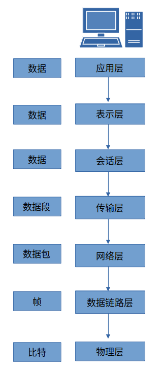
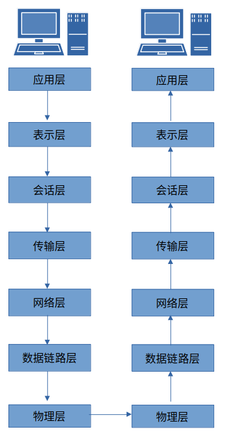

## 协议

> **协议**（protocol）定义了在两个或多个通信实体之间交换的报文的格式和顺序，以及报文发送和/或接收一条报文或其他事件所采取的动作。
> 
> 协议是一套共同的网络语言，帮助多种运行在不同平台上的异构系统之间相互通信。不同的协议用于完成不同的通信任务。

常见的网络协议包括：

- 传输控制协议（TCP）
- 互联网协议（IP）
- 地址解析协议（ARP）
- 动态主机配置协议（DHCP）

协议通常用来解决以下问题：
- 发起连接
- 协商连接参数
- 数据格式
- 错误检测与校正
- 连接终止

## OSI七层参考模型

> 记忆口诀：物数网传会表应

第七层：应用层，application layer，访问网络资源的实际程序。协议：HTTP、SMTP、FTP、Telnet

第六层：表示层，presentation layer，将接收到的数据转换成应用层可以读取的格式，同时进行数据的加解密等操作。协议：ASCII、MPEG、JPEG、MIDI

第五层：会话层，session layer，负责所有通信设备间建立、管理、和终止会话连接。协议：NetBIOS、SAP、SDP、NWlink

第四层：传输层，transport layer，提供可靠的数据传输服务，确保网络数据端到端的无差错传输。协议：TCP、UDP、SPX

第三层：网络层，network layer，负责数据在物理网络中的路由转发，负责网络主机的逻辑寻址，还处理数据包分片和一些情况下的错误检测。路由器工作在这一层。协议：IP、IPX

第二层：数据链路层，data link layer，提供了通过物理网络传输数据的方法，主要目的是提供一个寻址方案，可用于确定物理设备。网桥和交换机是工作在数据链路层的物理设备。协议：Ethernet、Token Ring、FDDI、AppleTalk

第一层：物理层，physical layer，传输网络数据的物理媒介，定义了所有使用的网络硬件设备的物理和电气特性，包括电压、集线器、网络适配器、中继器、线缆规范等。

**数据流向**：通信数据从一个通信端的顶部应用层开始，沿着OSI参考模型的七层逐步向下，直到物理层，接收端从物理层获取到传输数据，向上逐层处理，直到最高的应用层。

**数据封装**： 每一层的数据描述的术语，物理层叫比特(bit)，数据链路层叫帧（frame），网络层叫数据包（datagram），传输层叫数据段(segment)，应用层叫数据(message)。

> 实际的 TCP/IP 协议栈中没有单独设计会话层和表示层。