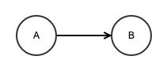
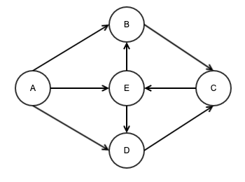
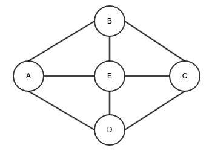
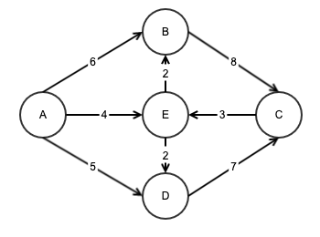

> 最近做了一些涉及到图的算法题，特此归纳总结一下图的基础、广度优先搜索、深度优先搜索、迪克斯特拉算法以及贝尔曼福德算法。

## 什么是图

[图](https://zh.wikipedia.org/wiki/图_(数学))是由节点（node）和边（edge）组成的一种数据结构。上图中，A 和 B 是该图的节点，连接线是图的一条边。

图模拟了一组连接，一个节点可能与很多节点直接相连，这些节点称为**邻居节点**，需要注意的是，在上面的图中，A指向B，说明B是A的邻居节点，但B没有指向A，说明A不是B的邻居节点。

## 图的分类

### 有向图

如果给图的每条边都规定一个方向，那么该图就称为有向图，有向图所有的连接关系都是单向的。

### 无向图

边没有方向的图称为无向图，无向图其实意味着图的**两个节点彼此指向对方**，其实就是环。

### 加权图

图的每条边都有关联的数字，这些数字称为**权重**，带权重的图称为**加权图**。

### 非加权图

不带权重的图称为非加权图。

## 广度优先搜索(Breadth-First-Search)

> **广度优先搜索算法**（英语：Breadth-First-Search，缩写为BFS），又译作**宽度优先搜索**，或**横向优先搜索**，是一种[图形搜索算法](https://zh.wikipedia.org/w/index.php?title=圖形搜索演算法&action=edit&redlink=1)。简单的说，BFS是从[根节点](https://zh.wikipedia.org/w/index.php?title=根節點&action=edit&redlink=1)开始，沿着树的宽度遍历树的[节点](https://zh.wikipedia.org/wiki/节点)。如果所有节点均被访问，则算法中止。广度优先搜索的实现一般采用open-closed表

[广度优先搜索](https://zh.wikipedia.org/wiki/广度优先搜索)解决两类问题：

1. 从节点A出发，有没有前往节点B的路径
2. 从节点A出发，前往节点B的那条路径最短，或者说哪条路径的段数最少？

广度优先搜索中，起点的邻居称为一度关系，其邻居的邻居称为二度关系，搜索顺序是先一度关系，再二度关系，以此类推。在代码实现时，需要使用**双端队列**来保证搜索顺序。

广度优先搜索的步骤：

1. 创建一个队列，将起点的所有邻居节点压入到队列中；
2. 从队列弹出一个节点，检查这个节点是否终点，如果是，则完成搜索；
3. 如果该节点不是终点，则将该节点的所有邻居节点压入上述队列中；
4. 回到第2步，继续检查；
5. 如果队列为空，说明终点不可达，找不到该路径。

## 狄克斯特拉算法(Dijkstra)

> **戴克斯特拉算法**（英语：Dijkstra's algorithm，又译**迪杰斯特拉算法**）由荷兰计算机科学家[艾兹赫尔·戴克斯特拉](https://zh.wikipedia.org/wiki/艾兹赫尔·戴克斯特拉)在1956年提出。戴克斯特拉算法使用了[广度优先搜索](https://zh.wikipedia.org/wiki/广度优先搜索)解决赋权有向图的单源[最短路径问题](https://zh.wikipedia.org/wiki/最短路径问题)。该算法存在很多变体；戴克斯特拉的原始版本找到两个顶点之间的最短路径，但是更常见的变体固定了一个顶点作为源节点然后找到该顶点到图中所有其它节点的最短路径，产生一个[最短路径树](https://zh.wikipedia.org/wiki/最短路径树)。该算法常用于[路由](https://zh.wikipedia.org/wiki/路由)算法或者作为其他图算法的一个子模块。举例来说，如果图中的顶点表示城市，而边上的权重表示城市间开车行经的距离，该算法可以用来找到两个城市之间的最短路径。

广度优先搜索可以找到段数最少的路径，但是无法找到**开销**最小的路径，[狄克斯特拉算法](https://zh.wikipedia.org/wiki/戴克斯特拉算法)就是用来解决这类问题的。什么是**开销**，可以理解为总权重，假设从起点出发到节点B需要2小时，那么可以称起点到节点B的**开销**为2。当然，开销也可以是其他的计量单位，例如从起点出发到节点B距离3公里，可以计作起点到节点B的**开销**为3。

狄克斯特拉算法的步骤：

1. 找出开销最小的节点，即可以在最短的时间内到达的节点；
2. 更新该节点的邻居的开销；
3. 重复这个过程，直到图中所有的节点都处理完；
4. 计算开销最小的路径。

注：狄克斯特拉算法仅适用于**有向无环图**

## 深度优先搜索(Depth-First-Search)

> **深度优先搜索算法**（英语：Depth-First-Search，DFS）是一种用于遍历或搜索[树](https://zh.wikipedia.org/wiki/树_(数据结构))或[图](https://zh.wikipedia.org/wiki/图_(数学))的[算法](https://zh.wikipedia.org/wiki/算法)。沿着树的深度遍历树的节点，尽可能深的搜索树的分支。当节点v的所在边都己被探寻过，搜索将回溯到发现节点v的那条边的起始节点。这一过程一直进行到已发现从源节点可达的所有节点为止。如果还存在未被发现的节点，则选择其中一个作为源节点并重复以上过程，整个进程反复进行直到所有节点都被访问为止。属于盲目搜索。

从图G的某个顶点v0出发，访问v0，然后选择一个与v0相邻且没被访问过的顶点vi访问，再从vi出发选择一个与vi相邻且未被访问的顶点vj进行访问，依次继续。如果当前被访问过的顶点的所有邻接顶点都已被访问，则退回到已被访问的顶点序列中最后一个拥有未被访问的相邻顶点的顶点w，从w出发按同样的方法向前遍历，直到图中所有顶点都被访问。

深度优先搜索的步骤：

1. 首先将起点放入到队列中；
2. 从队列弹出一个节点，并检查它是否为终点，如果是，则完成搜索，返回结果；
3. 如果不是终点，则将它某一个没有检查过的邻居节点加入到队列中；
4. 回到第2步；
5. 如果不存在未检查过的邻居节点，则将其父节点加入队列中，回到第2步；
6. 重复第5步；
7. 如果队列为空，表示所有的节点都检查过了，完成搜索，返回找不到终点

### 参考文献

- 《算法图解》
- 《算法（第4版）》
- [维基百科-图](https://zh.wikipedia.org/wiki/图_(数学))
- [维基百科-广度优先搜索](https://zh.wikipedia.org/wiki/广度优先搜索)
- [维基百科-戴克斯特拉算法](https://zh.wikipedia.org/wiki/戴克斯特拉算法)
- [维基百科-深度优先搜索](https://zh.wikipedia.org/wiki/深度优先搜索)
- [wikipedia-Backtracking](https://en.wikipedia.org/wiki/Backtracking)