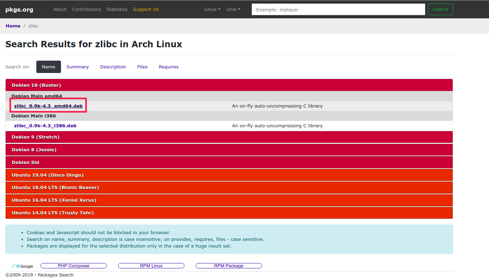
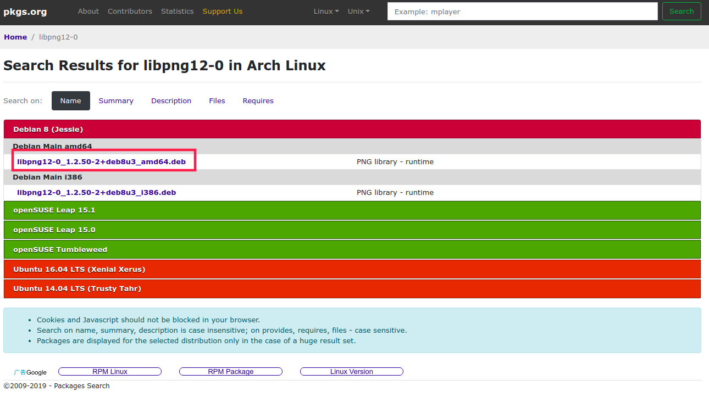
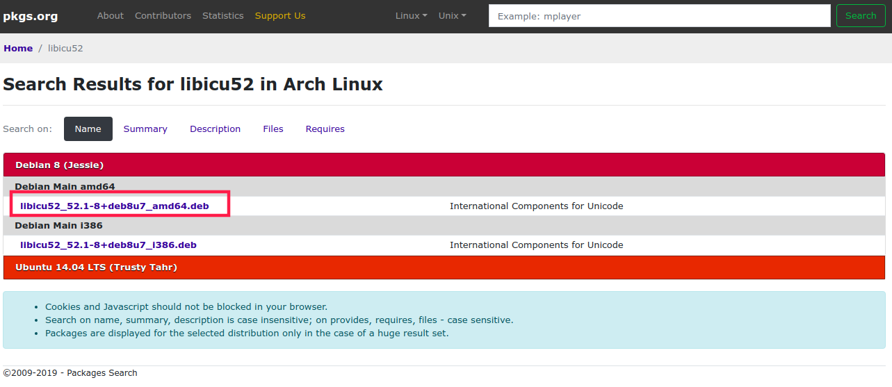

1. 下载 redis-desktop-manager_0.8.3-120_amd64.deb，链接: https://pan.baidu.com/s/1U_bFloEEV5ERtZ-Wv5yj8g 提取码: ufjp

2. 执行`sudo dpkg -i redis-desktop-manager_0.8.3-120_amd64.deb`进行安装；

```shell
jason@jason-Latitude-5490:~/Downloads$ sudo dpkg -i redis-desktop-manager_0.8.3-120_amd64.deb 
[sudo] jason 的密码： 
正在选中未选择的软件包 redis-desktop-manager。
(正在读取数据库 ... 系统当前共安装有 276640 个文件和目录。)
正准备解包 redis-desktop-manager_0.8.3-120_amd64.deb  ...
正在解包 redis-desktop-manager (0.8.3-120) ...
dpkg: 依赖关系问题使得 redis-desktop-manager 的配置工作不能继续：
 redis-desktop-manager 依赖于 zlibc；然而：
  未安装软件包 zlibc。
 redis-desktop-manager 依赖于 libpng12-0；然而：
  未安装软件包 libpng12-0。
 redis-desktop-manager 依赖于 libicu52；然而：
  未安装软件包 libicu52。
 redis-desktop-manager 依赖于 libssh2-1；然而：
  未安装软件包 libssh2-1。

dpkg: 处理软件包 redis-desktop-manager (--install)时出错：
 依赖关系问题 - 仍未被配置
正在处理用于 gnome-menus (3.13.3-11ubuntu1.1) 的触发器 ...
正在处理用于 desktop-file-utils (0.23-1ubuntu3.18.04.2) 的触发器 ...
正在处理用于 mime-support (3.60ubuntu1) 的触发器 ...
在处理时有错误发生：
 redis-desktop-manager
```

3. 如上所示，会提示缺少依赖，到 https://pkgs.org/ 搜索依赖包，下载后双击deb文件进行依赖包的安装；

   

   

   

4. 再次执行 `sudo dpkg -i redis-desktop-manager_0.8.3-120_amd64.deb`

```shell
jason@jason-Latitude-5490:~/Downloads$ sudo dpkg -i redis-desktop-manager_0.8.3-120_amd64.deb 
(正在读取数据库 ... 系统当前共安装有 277102 个文件和目录。)
正准备解包 redis-desktop-manager_0.8.3-120_amd64.deb  ...
正在将 redis-desktop-manager (0.8.3-120) 解包到 (0.8.3-120) 上 ...
正在设置 redis-desktop-manager (0.8.3-120) ...
正在处理用于 gnome-menus (3.13.3-11ubuntu1.1) 的触发器 ...
正在处理用于 desktop-file-utils (0.23-1ubuntu3.18.04.2) 的触发器 ...
正在处理用于 mime-support (3.60ubuntu1) 的触发器 ...

```
