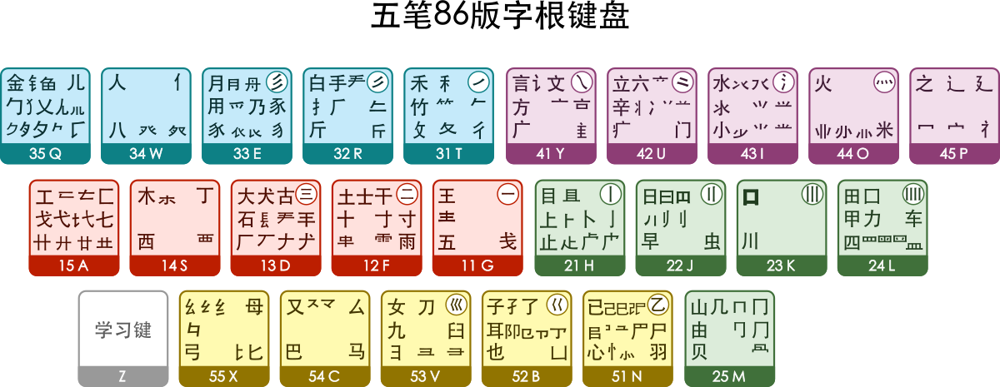

---

slug: "/86-wubi"

description: "86版五笔简明教程"
title: "86版五笔简明教程"
date: 2025-06-09
summary: "86版五笔简明教程"
tags: ['coding']
draft: false
---

五笔输入法，简称五笔，是一种汉字形码输入法，区别于拼音输入法，其核心基础是“王永民”先生于1983年发明的王码五笔，至今（2013年）已有三个核心定型版本：86版、98版、新世纪版（2008年发布），其它五笔，诸如万能五笔、极点五笔、搜狗五笔、海峰五笔、智能五笔、小鸭五笔均是在王码五笔基础上发展的，以86最为普及，可能因版权原因，98版及新世纪版极少有其它五笔输入法支持。

汉字是一种意形结合的象形文字，形体复杂，笔画繁多，它最基本的成分是笔画，由基本笔画构成汉字的偏旁部首（字根），再由字根组成有形有意的汉字。

五笔字型是一种纯字型的编码方案，它由130个字根组字，重码少，便于盲打，输入速度快。

“五笔”原意是也指五种基本笔画：横、竖、撇、捺（点）、折，任何一个汉字，也都是由这五种基本笔画及其衍生字根组成，通过使用一定的映射规则，至多只需要4个字母，即可完成一个汉字或词组的输入。

## 字根

五笔字根是五笔输入法的基本单元，86版使用234个字根，98版使用259个字根，新世纪版使用了226个字根。

86五笔字根表



### 口诀

横区

```text
G 王旁青头戋（兼）五一
F 土士二干十寸雨
D 大犬三（羊）古石厂
S 木丁西
A 工戈草头右框七
```

竖区

```text
H 目具上止卜虎皮
J 日早两竖与虫依
K 口与川，字根稀
L 田甲方框四车力
M 山由贝，下框几
```

撇区

```text
T 禾竹一撇双人立，反文条头共三一
R 白手看头三二斤
E 月彡（衫）乃用家衣底
W 人和八，三四里
Q 金勺缺点无尾鱼，犬旁留儿一点夕，氏无七（妻）
```

点区

```text
Y 言文方广在四一，高头一捺谁人去
U 立辛两点六门疒
I 水旁兴头小倒立
O 火业头，四点米
P 之字军盖道建底，摘礻（示）衤（衣）
```

折区

```text
N 已半巳满不出己，左框折尸心和羽
B 子耳了也框向上
V 女刀九臼山朝西
C 又巴马，丢矢矣
X 慈母无心弓和匕，幼无力
```

口诀解释：

```
11-G　王旁青头戋（兼）五一，(“兼”与“戋”同音) 
12-F　土士二干十寸雨。　 
13-D　大犬三羊古石厂， （“羊”指羊字底） 
14-S　木丁西， 
15-A　工戈草头右框七。 （“右框”即“匚”） 

21-H　目具上止卜虎皮， (“具上”指具字的上部) 
22-J　日早两竖与虫依。 
23-K　口与川，码元稀， 
24-L　田甲方框四车力。 (“方框”即“囗”)
25-M　山由贝，下框几。

31-T　禾竹一撇双人立， (“双人立”即“彳”)。 反文条头共三一。 (“条头”即“夂”) 
32-R　白手看头三二斤， 
33-E　月彡(衫)乃用家衣底。 (“家衣底”即“豕”) 
34-W  人和八，三四里， (“人”和“八”在34里边) 
35-Q　金勺缺点无尾鱼， (指“钅、勹”) 。
犬旁留叉儿一点夕， ( 指“乂、儿、夕”) 。
氏无七（妻）。 (“氏”去掉“七”) 

41-Y　言文方广在四一， 高头一捺谁人去。(“谁”去掉“亻” 为“讠、谁”) 
42-U　立辛两点六门疒， 
43-I　 水旁兴头小倒立。 (指“氵、兴、小”) 
44-O　火业头，四点米， (“业头”即“ 业 ”) 
45-P　之字军盖建道底， (即“之、宀、冖、廴、辶”) 
      摘礻(示)衤(衣)。 (“礻、衤”摘除末笔画即“ 礻”) 

51-N　已半巳满不出己， 左框折尸心和羽。 
52-B　子耳了也框向上。 (“框向上”即“凵”) 
53-V　女刀九臼山朝西。 (“山朝西”即“彐”) 
54-C　又巴马，丢矢矣， (“矣”去“矢”为“厶”) 
55-X　慈母无心弓和匕， 幼无力。(“幼”去“力”为“幺”) 
```

## 五笔中的汉字结构及字型

在五笔中，汉字分为左右型、上下型和杂合型汉字。凡是分不清上下左右结构的就是杂合型。

## 汉字的笔画

五笔字型把汉字笔画分成五种，对应键盘上的五个区：横（提）、竖（左竖钩）、撇、捺（点）、折（右竖钩）五种。

## 单字输入规则

大多数汉字的基本输入规则

能拆分为两个码元的字：第一码元 + 第二码元 + 空格

如“明”字，拆分为“日”和“月”两个码元打"JE "

能拆分为三个码元的字：第一码元 + 第二码元 + 第三码元 + 空格

如“些”字，拆分为“止”“匕”“二”打"HXF "

能拆分为四个码元的字：第一码元 + 第二码元 + 第三码元 + 第四码元

如“命”字，拆分为“人”“一”“口”“卩”打"WGKB"

拆分超过四个码元的字：第一码元 + 第二码元 + 第三码元 + 最末码元

如“厨”字，拆分为“厂”“一”“口”和最后一个码元“寸”打"DGKF"

键面上汉字的输入规则

键面上第一个码元（键左上角）：把所在键连打四下，例如：“土”字就是打四下F，即FFFF。

成字码元（第一个之外的）的输入规则: 所在键 + 第一单笔画 + 第二单笔画 + 最末单笔画，例如“雨”字，先打F（打“雨”字所在的键），然后再打“一”“|”“丶”三个单笔画所在的键，所以“雨”字的编码就是FGHY

举例：“士”拆分为“一”“|”“一”编码为：FGHG。 “文” 拆分为 “丶” “一” “丶” 编码为：YYGY

识别码字

五笔为了减少重码，先打完码元，可以再追加一个“末笔字型识别码”，简称“识别码”。识别码由字的结构类型和最后一笔的笔划决定。

有些汉字按基本规则打完码元以后还不能出来，这时识别码就是必须的了。

```text
结构\末笔   横（一）    竖（丨）    撇（丿）     捺（丶）    折（乙）
左右型      G           H           T           Y           N
上下型      F           J           R           U           B
杂合型      D           K           E           I           V
```

举例：“好”的码元是“女”和“子”，分别对应VB两个键。它是左右型，最后一笔是横，所以识别码是G。完整的编码就是VBG。

## 词组输入规则

双字词

取第一字的前两位编码和第二字的前两位编码，如“北”（UXN）+“京”（YIU）=“北京”（UXYI）

三字词

取第一字的第一位编码，第二位的第一位编码，第三字的前两位编码，如“毛”（TFNV）+“泽”（ICFH）+“东”（AII）=“毛泽东”（TIAI）

四字词

取每一个字的第一位编码，如“发”（NTCY）+“奋”（DLF）+“图”（LTUI）+“强”（XKJY）=“发奋图强”（NDLX）

多字词

取一、二、三、末字的第一位编码，如“共”（AWU）＋“产”（UTE）＋“主”（YGD）＋“义”（YQI）＋“社”（PYFG）＋“会”（WFCU）＝共产主义社会（AUYW）

## 简码字

一些较常用字可以用一、二或三字母编码打出，分别称为一、二、三级简码。

一级简码包含汉语最常用字中的25个，为了尽可能全面地安排最常用的汉字，部分一级简码并非是该字全码的首位。但所有的二级或三级简码均为该字全码的前二或三位。
