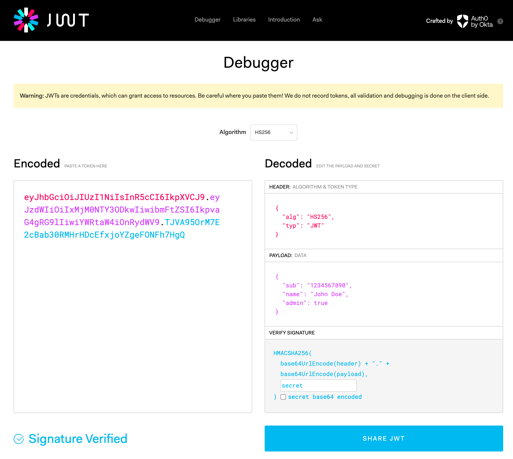
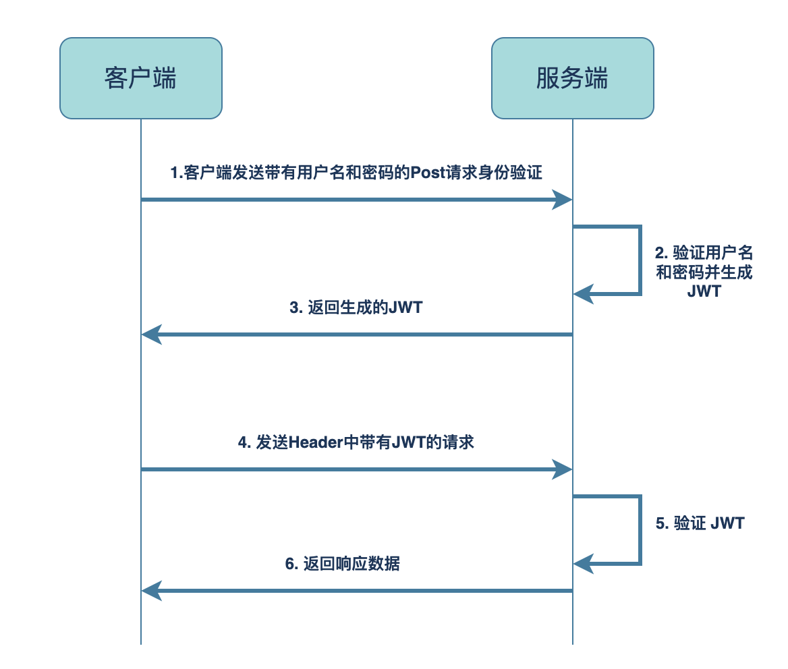

---

slug: "/Introduction-to-jwt"

description: "JSON Web Token 简介"
title: "[JWT] JSON Web Token 简介"
date: "2023-11-14 17:52:10"
summary: "JSON Web Token 简介"
tags: ['coding']

---

## 1. 什么是 JWT

`JSON Web Token`，简称`JWT`，读作`/dʒɒt/`， 是一种开放标准（[RFC 7519](https://tools.ietf.org/html/rfc7519)），用于以JSON对象的方式安全地传输信息，由于传输的信息是经过数字签名的，所以信息可被验证和信任。

## 2. JWT 的使用场景

- 授权：这是使用JWT最常见的场景。用户登录后，每个后续请求都将包含JWT，从而允许用户访问该令牌允许的路由、服务和资源。单点登录是目前广泛使用JWT的功能，它的开销小并且能够轻松跨域使用。例如，服务器可以生成一个声明为“以管理员身份登录”的令牌，并将其提供给客户端，客户端可以使用该令牌来证明它以管理员身份登录。
- 信息交换：JWT是在应用间安全传输信息的好方法。JWT可以使用密钥对进行签名，所以可以确定发送者。由于签名是使用`Header`和`Payload`计算的，因此可以验证内容是否未被篡改。

## 3. JWT 的结构

一个`JWT`是由`Header`、`Payload`、`Signature`三个元素构成的字符串，使用`.`分隔(Header.Payload.Signature)。前两个元素是特定结构的JSON对象，通常经过`base64url`编码。第三个是将Header和Payload的内容组合并加密。下面是一个`JWT`示例（为了方便阅读，加了换行符）：

```
eyJhbGciOiJIUzI1NiIsInR5cCI6IkpXVCJ9.
eyJzdWIiOiIxMjM0NTY3ODkwIiwibmFtZSI6IkpvaG4gRG9lIiwiYWRtaW4iOnRydWV9.
TJVA95OrM7E2cBab30RMHrHDcEfxjoYZgeFONFh7HgQ
```

在 [https://jwt.io/#debugger-io](https://jwt.io/#debugger-io) 进行解码后如下图所示，**Header** 中指定了使用`HS256`算法进行签名，令牌类型为JWT；**Payload**中包含了sub、name、admin信息；**Signature**中， 使用header和payload以及特定的`secret`来生成签名。




- **Header**：通常由令牌的类型和签名算法两部分组成，经过对该`JSON`进行Base64Url编码后形成第一个元素。

- **Payload**：包含传输的数据。官方称作声明( claims)，用来描述实体（通常是用户）和附加数据，声明分为三类：

  - 注册声明(registered claims)：预定义的声明，非强制性，都只有三个字符，旨在紧凑。包含：
    - `iss` ：Issuer
    - `exp`：Expiration Time
    - `sub` ：Subject
    - `aud`：Audience
    - `nbf`：Not Before
    - `iat`：Issued At
    - `jti`：JWT ID
  - 公共声明(public claims)：遵循 [IANA JSON Web Token Registry](https://www.iana.org/assignments/jwt/jwt.xhtml) 中定义的声明命名，或者防冲突的命名
  - 私有声明(private claims)：用户自定义声明。

- **Signature** 用于验证JWT的真实性和完整性，签名的生成方式通常是将Header和Payload组合起来，使用一个secret key 进行计算，然后再与令牌中的签名部分比对

## 4. JWT 工作流程



首先客户端发送带有用户名和密码的Post请求。服务端验证身份成功后，生成JWT返回给客户端。后续所有的请求中，客户端都会在Header中带上这个toekn（JWT），服务端通过token验证用户身份，返回对应的响应数据。


## 参考文献
- [JWT.IO](https://jwt.io/introduction/)
- [JWT Handbook](https://auth0.com/resources/ebooks/jwt-handbook?_ga=2.186766504.1633974048.1699948492-2054291612.1699940448&_gl=1*1c5u08o*rollup_ga*MjA1NDI5MTYxMi4xNjk5OTQwNDQ4*rollup_ga_F1G3E656YZ*MTY5OTk1MzQ2OS4yLjEuMTY5OTk1NDg3Mi42MC4wLjA.*_ga*MjA1NDI5MTYxMi4xNjk5OTQwNDQ4*_ga_QKMSDV5369*MTY5OTk1MzQ2OS4yLjEuMTY5OTk1NDg3My42MC4wLjA.)
- [wikipedia JSON Web Token](https://en.wikipedia.org/wiki/JSON_Web_Token)
- [JSON Web Token Claims](https://www.iana.org/assignments/jwt/jwt.xhtml)