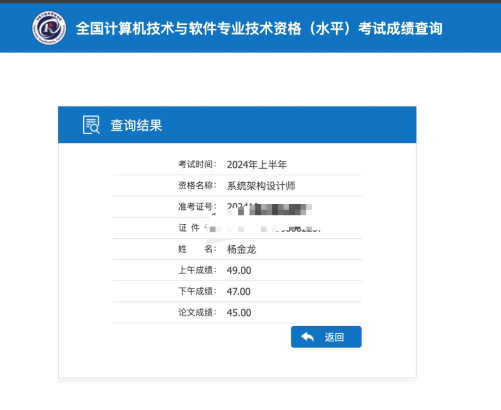

---

slug: "/architect-exam-2024"

description: "2024年系统架构设计师考试经验和心得分享"
title: '2024年系统架构设计师考试经验和心得分享'
date: "2024-07-14 21:53:00"
summary: "2024年系统架构设计师考试经验和心得分享"
tags: ['life']
draft: false
---

2024年5月，我通过了系统架构设计师考试 ，这是我第二次参加系统架构设计师的考试。

第一次参加系统架构设计师考试是在2023年11月，恰逢教材改版，新教材的知识点太多，且2023年工作真的是非常忙，虽然在坚持执行学习计划，网上找视频、啃教材、刷题，但还是有很多考点都掌握的不到位，案例分析题准备的不充分，学得非常累，考试没有通过。大致总结分析了一下没有通过的原因：一方面，在学习上投入的时间不够，工作很忙，经常加班，回到家时间也非常有限；另一方面，我认为完全靠自己学习整理考点，还是很有难度的，而且又遇到了教材改革，那么厚一本书，那么多历年考题，哪些是重点要必须掌握的，哪些是可以少花点儿精力的，整理起来非常耗时间，而且确实也没什么头绪。

看到成绩后，我的第一反应就是，我要报个培训机构跟班学。我认为第一，有专业的讲师，系统化体系化的讲课；第二，我需要一个学习环境，有学习氛围，投入更多的时间学习；第三，培训机构更专业能够抓重点抓考点。

在选择培训机构的时候，我并没有过多纠结，我觉得跟我对接的售前老师应该挺嗨皮的，不用费心多聊，我就果断交钱了。以前多少都看过一些网上不同机构的视频课，我认为51CTO的课程体系、配套软件、视频课录制和课件内容的质量是更好更专业的。另外，我个人偏好普通话比较好的讲师，不标准的普通话讲课，我听着真的挺难受的。综上，果断选了51CTO。

### 一、学习计划

#### 重视考试，坚定信心

我做了十多年Java开发，架构师一直是我的梦想和目标，通过考取架构师认证也是对自己的认可和鼓励。35岁前通过系统架构设计师考试，也是我的目标。去年没有后通过考试，我并没有气馁，反倒更加坚定了信息，2024年一定要通过考试。

#### 严格执行学习计划

备考的过程也是一个项目，需要正确的项目管理。我把计划做成了三个阶段，第一阶段，看视频看书；第二阶段刷题、跟直播课；第三阶段写论文，查漏补缺；我的计划是按照视频课的顺序，细化到每一个章节，记录在Excel上，每天学习1-2个小时，每天更新进度和调整计划，在51CTO的课程中心显示我的学习时长是117.5小时，如果特殊情况有偏差，我会及时更新计划，课程进度是严格按照计划执行的。

#### 家人支持

我白天工作非常忙，几乎没有时间学习，只能是在上下班的路上，或者下班回家之后。所以非常需要家人的支持，提供一个 1-2 小时几乎无干扰的学习环境。我很感激我的家人全力支持我备考，家人也为此付出了很多。

### 二、选择题

认真看录播课，完成课后作业。刷历年真题，标记错题，把对应的知识点在视频里或者书上找到，多看几遍，一定要弄懂，不能只记答案，不然换个问法又选不出来了。

有舍有得，不要想着全部题都拿下，把时间和精力花在稳定拿分的题上。例如：运筹学的计算题，搞不定就放弃，不要多花时间；英语题，靠吃老本吧，能得几分算几分。网络知识题，历年真题看一看就行了，其它的别研究了，太花时间，考也考不了几分。

### 三、案例题

录播课看完之后，一定要去听直播课。听邹老师的话，让背的就乖乖背，别那么多理由，考的时候你就知道了。我的方法是自己多编一些顺口溜，老师们也编了一些非常顺的，比如RUP的“不用使劲记”这种，非常好记，借鉴这个方法，我觉得自己编的自己可能记得更快。

刷历年真题，动手把自己的答案写出来，然后和参考答案做比对，案例题的答案不是固定的，答到得分点就能拿分，也可以参考一下AI工具给的答案，比如文心一言、豆包等。

案例题方面，我认为几个重要的知识点，软件工程知识点， 方法、过程、工具。关注AI、物联网等新技术。软件架构知识点，架构风格、架构评估、教材下篇的各种架构。另外多关注一些架构问题的解决方案，比如今年考了分布式锁的死锁场景，如果平时关注或者用到，回答起来还是比较得心应手的。

### 四、论文

论文方面，我两次都过了，但是分数都不高，我的行文水平很差。我觉得重要是学习论文框架以及学会使用论文框架，关键就是一定要动手写，写两篇就找到感觉了，一千多字都是可以事先准备好的，另外，一定要参加模考，改论文的老师，批改的非常仔细非常严格，我两篇论文都是各种修改之后，才给了我45分。

### 总结

终于在我35岁之前，如愿拿下了系统架构师考试。以上简单分享了一下我的一些经验和心得，希望能对后来的考生一点点帮助。最后，真心感谢各位老师，讲师邹老师、助教老师古风、班主任梦星老师都超级负责任，帮助我们顺利上岸。

