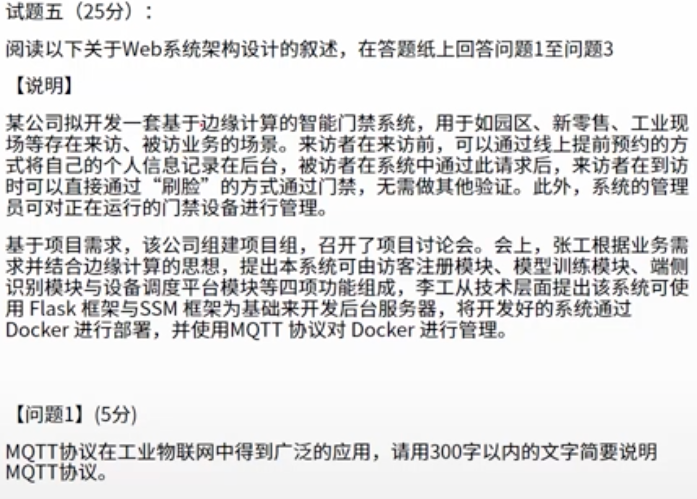

---

slug: "/architecture-case-analysis"

description: "系统架构设计案例分析"
title: "系统架构设计师-案例分析"
date: "2024-03-06 21:11:47"
summary: "系统架构设计案例分析"
tags: ['coding']

---

## 一、架构风格比较与分析（2022年）

参考答案：

**可修改性：**
面向对象风格通过编写新的规则实现代码，并通过应用重启或热加载添加规则，可修改性稍差；解释器风格通过编写新的规则文件，并通过导入资源文件或外部配置添加规则，可修改性较好。

**灵活性：**
面向对象风格通过策略模式定义规则对象，规则以程序逻辑实现，灵活性较差；解释器风格可灵活定义规则计算表达式，灵活性较好。

**性能：**
面向对象风格以编译后的代码运算规则，性能较好；而解释器风格需要加载规则、解析规则后，再运算得出结果，性能较差。

该项目在系统性能方面不做过多考虑，更注重灵活性，因此建议采用解释器风格。

## 二、数据流图的数据平衡原则（2022年）

简要介绍数据流图在分层细化过程中遵循的数据平衡原则。

参考答案：教材P194

1. 父图中描述过的数据流必须要在相应的子图中出现；
2. 一个处理至少有一个输入流和一个输出流；
3. 一个存储必定有输入的数据流和流出的数据流；
4. 一个数据流至少有一端是处理端；
5. 模型图中表达和描述的信息是全面的、完整的、正确的和一致的。

## 三、数据流图和数据字典的作用（2022年）

在结构化分析和设计过程中，数据流图和数据字典是常用的技术手段，请简要说明它们在软件需求分析和设计阶段的作用。

参考答案：

需求分析阶段：数据流图的目的是描述系统的功能需求，利用应用问题域中数据及信息的提供者与使用者、信息的流向、处理、存储4中元素描述系统需求，建立应用系统的功能模型。

设计阶段：数据字典是描述数据的信息集合，是对系统中使用的所有数据元素定义的集合。数据字典最重要的作用是作为分析阶段的工具，在结构化分析中，数据字典给数据流图上的每个元素加以定义和说明。

## 四、数据库缓存（2022年）

参考答案：

李工同步方案的思路：更新数据时在同一事务内一次完成删除缓存、更新数据库，再写入缓存。

张工异步准实时方案思路：更新数据时，首先通过消息队列发布待更新的数据消息给更新缓存的服务，然后再更新数据库；缓存更新服务订阅消息队列，等待收到更新事件后执行缓存更新。

参考答案：

哈希算法通过某种哈希散列得到一个值，按该值将数据分配到集群响应节点进行缓存。

一致性哈希算法将这个那个哈希值空间映射成一个按顺时针方向组织的虚拟圆环，使用哈希算法计算出哈希值，然后根据哈希值的位置沿圆环顺时针查找，将数据分配到第一个遇到的集群节点进行缓存。

一致性哈希算法有两大优点：
（1）可扩展性。保证了增加或者减少服务器时，数据存储的改变最少，相比传统哈希算法大大节省了数据迁移的开销；
（2）更好的适应数据的快速增长。

参考答案：

- 工作原理：布隆过滤器是一种用于快速判断一个元素是否可能存在于一个集合中的数据结构，通过多个哈希函数将元素映射到位向量中，设置相应位置为 1。查询时，若所有位置都为 1 则判断可能存在，否则一定不存在。
- 优点：节省空间，判断速度快
- 缺点：存在误判可能

## 五、Web系统架构设计（2022年）

MQTT（Message Queuing Telemetry Transport）协议是一种轻量级的发布/订阅消息协议，用于物联网（IoT）设备之间的通信。它基于 TCP/IP 协议，以简洁、高效的方式传输消息。

MQTT 协议具有以下特点：

- 发布/订阅模式：设备可以发布消息，其他设备可以订阅感兴趣的主题来接收消息。
- 轻量级：报文小，占用带宽少，适用于资源受限的设备。
- 可靠性：支持 QoS 级别，确保消息的可靠传输。
- 主题分层：支持主题的分层结构，方便消息的分类和管理。

MQTT 协议广泛应用于物联网领域，如智能家居、工业自动化等，使得设备之间的通信更加简单、高效。

参考答案：

- 数据通信：减少数据传输延迟，提高实时性，因为边缘设备可在本地处理数据。
- 数据安全：增强数据安全性，数据在边缘端处理，减少云端数据暴露风险。
- 系统性能：减轻云端计算负担，提升系统整体效率，更好地应对大规模数据处理。