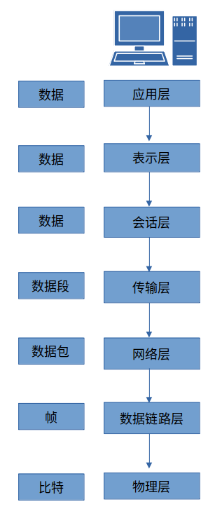
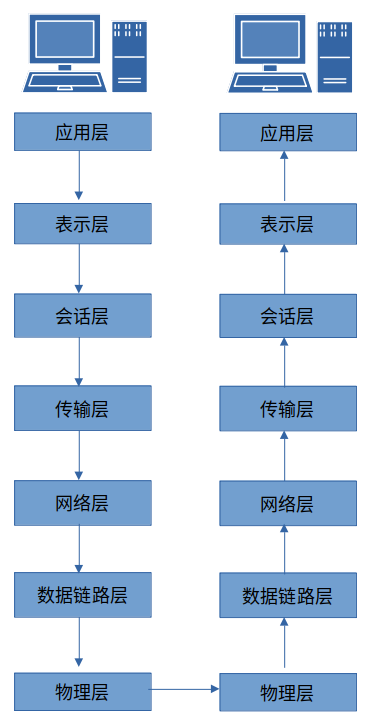
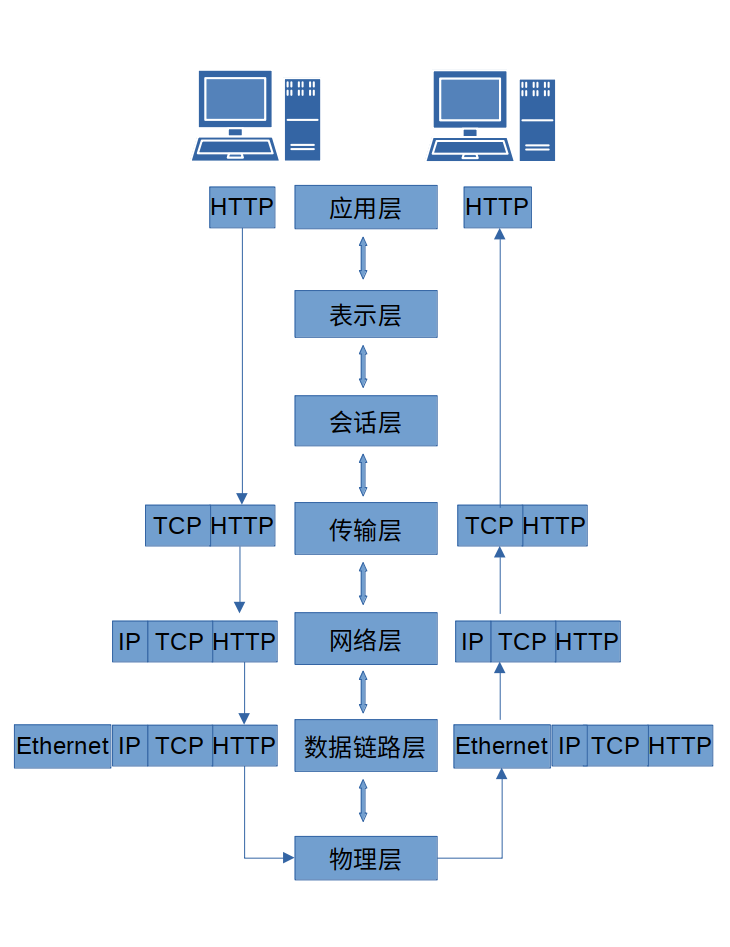
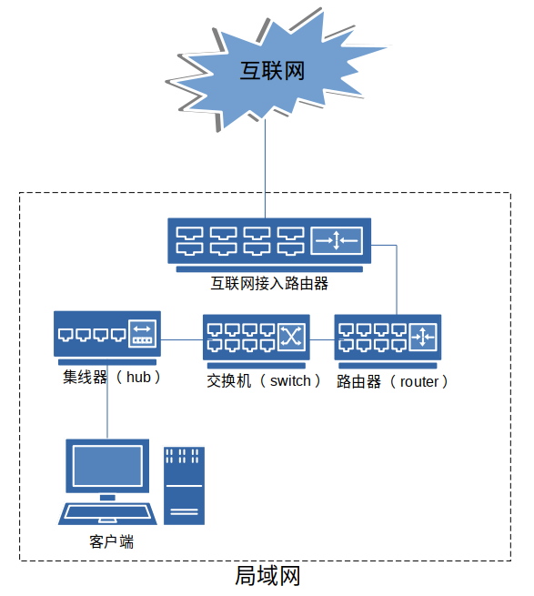
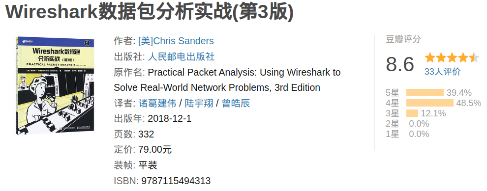
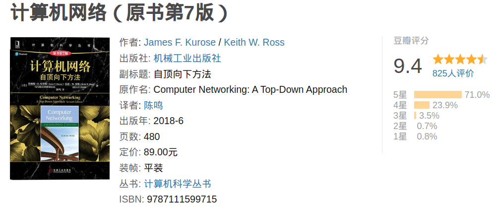
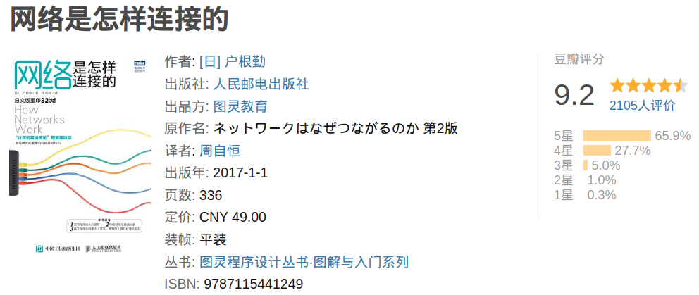

---

slug: "/basic-of-network"

description: "介绍常见的网络协议、OSI网络参考模型以及相关的网络硬件。"
title: 必须要掌握的网络通信原理
date: "2023-03-20 23:14:00"
summary: "介绍常见的网络协议、OSI网络参考模型以及相关的网络硬件。"
tags: ['coding']

---

## 一、协议

> **协议**（protocol）定义了在两个或多个通信实体之间交换的报文的格式和顺序，以及报文发送和/或接收一条报文或其他事件所采取的动作。
> 
> 协议是一套共同的网络语言，帮助多种运行在不同平台上的异构系统之间相互通信。不同的协议用于完成不同的通信任务。

常见的网络协议包括：

- 传输控制协议（TCP）
- 互联网协议（IP）
- 地址解析协议（ARP）
- 动态主机配置协议（DHCP）

协议通常用来解决以下问题：

- 发起连接
- 协商连接参数
- 数据格式
- 错误检测与校正
- 连接终止

## 二、OSI七层参考模型

### OSI参考模型协议分层

> 记忆口诀：**物 数 网 传 会 表 应**

第七层：**应用层**，application layer，访问网络资源的实际程序。协议：HTTP、SMTP、FTP、Telnet

第六层：**表示层**，presentation layer，将接收到的数据转换成应用层可以读取的格式，同时进行数据的加解密等操作。协议：ASCII、MPEG、JPEG、MIDI

第五层：**会话层**，session layer，负责所有通信设备间建立、管理、和终止会话连接。协议：NetBIOS、SAP、SDP、NWlink

第四层：**传输层**，transport layer，提供可靠的数据传输服务，确保网络数据端到端的无差错传输。协议：TCP、UDP、SPX

第三层：**网络层**，network layer，负责数据在物理网络中的路由转发，负责网络主机的逻辑寻址，还处理数据包分片和一些情况下的错误检测。路由器工作在这一层。协议：IP、IPX

第二层：**数据链路层**，data link layer，提供了通过物理网络传输数据的方法，主要目的是提供一个寻址方案，可用于确定物理设备。网桥和交换机是工作在数据链路层的物理设备。协议：Ethernet、Token Ring、FDDI、AppleTalk

第一层：**物理层**，physical layer，传输网络数据的物理媒介，定义了所有使用的网络硬件设备的物理和电气特性，包括电压、集线器、网络适配器、中继器、线缆规范等。

### 因特网 TCP/IP 协议分层

> 记忆口诀：**物 数 网 传 应**
> 实际的 TCP/IP 协议栈中没有单独设计会话层和表示层

各协议分层的所有协议称为协议栈，因特网协议栈由5个层次组成：物理层、数据链路层、网络层、传输层和应用层。

## 三、OSI参考模型中的数据流向

通信数据从一个通信端的顶部应用层开始，沿着OSI参考模型的七层逐步向下，直到物理层，接收端从物理层获取到传输数据，向上逐层处理，直到最高的应用层。OSI模型中的每层都只能直接与它的上层或下层协议通信。

## 四、数据封装

> 协议栈中每一层的数据都使用了特定的术语，物理层叫比特(bit)，数据链路层叫帧（frame），网络层叫数据包或数据报（datagram），传输层叫数据段或报文段(segment)，应用层叫数据或报文(message)。

数据封装过程将创建一个PDU（协议数据单元），在传输数据时，协议栈的每一层都会在传输数据上附上附加信息（头部或尾部协议信息），沿着协议栈每一层向下流动，PDU逐渐增长，直到物理层，并发送给目标计算机，接收端接到PDU后，从物理层逐层向上剥去协议头部和尾部，到达最顶层应用层时，只剩下原始传输数据。整个过程让我联想到俄罗斯套娃，假设最小的套娃是原始数据，发送数据时，一层一层的套上开始传输，到达目的地再一层一层的去掉，直到最小的套娃出现。

客户端和服务器间数据封装过程图示

## 五、网络硬件

网络数据包从客户端计算机发出后，要经过集线器、交换机和路由器最终进入互联网。实际上家用的路由器已经集成了集线器和交换机的功能。

### 1、集线器

集线器会将输入的信号广播到所有的端口，如果同时输入多个信号就会发生碰撞，无法同时传输多路信号。

### 2、交换机

- 交换机并不是简单地让信号流过，而是先接收信号并将其还原为数字信号，然后再重新转换成信号并发送出去的过程。
- 交换机可同时转发多个包
- 交换机的转发能力高于集线器

### 3、路由器

**路由器的工作原理：**
路由器包括转发模块和端口模块，路由器在转发包时，首先通过端口将发过来的包接收进来，这一步工作取决于端口对应的通信技术。接下来转发模块会根据接收到的包的IP头部中记录的接收方IP地址，在路由表中进行查询，以此判断转发目标。然后转发模块将包转移到转发目标对应的端口，端口再按照硬件的规则将包发送出去，也就是转发模块委托端口模块将包发送出去。

**交换机和路由器之间的差异：**
- 交换机和路由器的工作方式不同，交换机是基于以太网规格工作的设备，而路由器是基于IP的。
- 交换机只转发包，它自身不是发送方或接收方。

## 六、参考文献

- [《Wireshark数据包分析实战（第3版）》](https://book.douban.com/subject/30387220/)
    
- [《计算机网络-自顶向下方法（第7版）》](https://book.douban.com/subject/30280001//)
    
- [《网络是怎样连接的》](https://book.douban.com/subject/26941639/)
    
