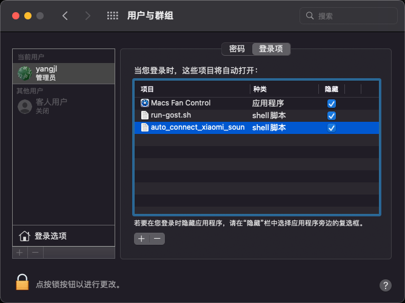
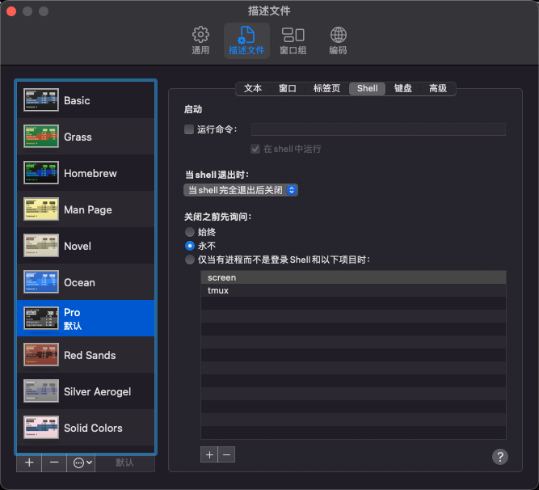
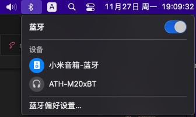

我希望开机后自动连接小米蓝牙音箱，在MAC OSX的设置界面，没有找到相关的设置。于是在网上找到了[blueutil](https://github.com/toy/blueutil)，分分钟轻松搞定。

### 安装`blueutil`

使用`homebrew`安装`blueutil`
```shell
brew install blueutil
```

### `blueutil -h` 查看使用说明

```shell
yangjl@Mac ~ % blueutil -h
blueutil v2.9.1

Usage:
  blueutil [options]
...
```

### 查看配对设备 `blueutil --paired` 
```shell
yangjl@Mac ~ % blueutil --paired 
address: 64-64-4a-7f-ad-85, connected (master, 0 dBm), not favourite, paired, name: "小米音箱-蓝牙", recent access date: 2023-11-27 10:57:15 +0000
address: 74-45-ce-dd-37-e6, not connected, not favourite, paired, name: "ATH-M20xBT ", recent access date: 2023-11-27 10:57:15 +0000
```

### 通过ID连接设备 `blueutil --connect ID`

上一步`address`的值就是ID，在终端输入 `blueutil --connect 设备ID`即可

### 查看已连接蓝牙设备 `blueutil --connected `

```shell
yangjl@Mac ~ % blueutil --connected                
address: 64-64-4a-7f-ad-85, connected (master, 0 dBm), not favourite, paired, name: "小米音箱-蓝牙", recent access date: 2023-11-27 10:59:40 +0000
```

### 设置自动连接

创建一个文件`auto_connect_bluetooth.sh`，文件内容如下，其中ID自行修改，

```shell
blueutil --connect 64-64-4a-7f-ad-85
echo '自动连接蓝牙至小米音箱'
exit
```

在终端执行`chmod +x auto_connect_bluetooth.sh`为文件增加执行权限。

`系统偏好设置` -> `用户与群组` -> `登陆项` -> `+` -> 选择 `auto_connect_bluetooth.sh``



另外建议把shell窗口设置的退出策略修改一下，这样执行完终端窗口就自动关闭了



