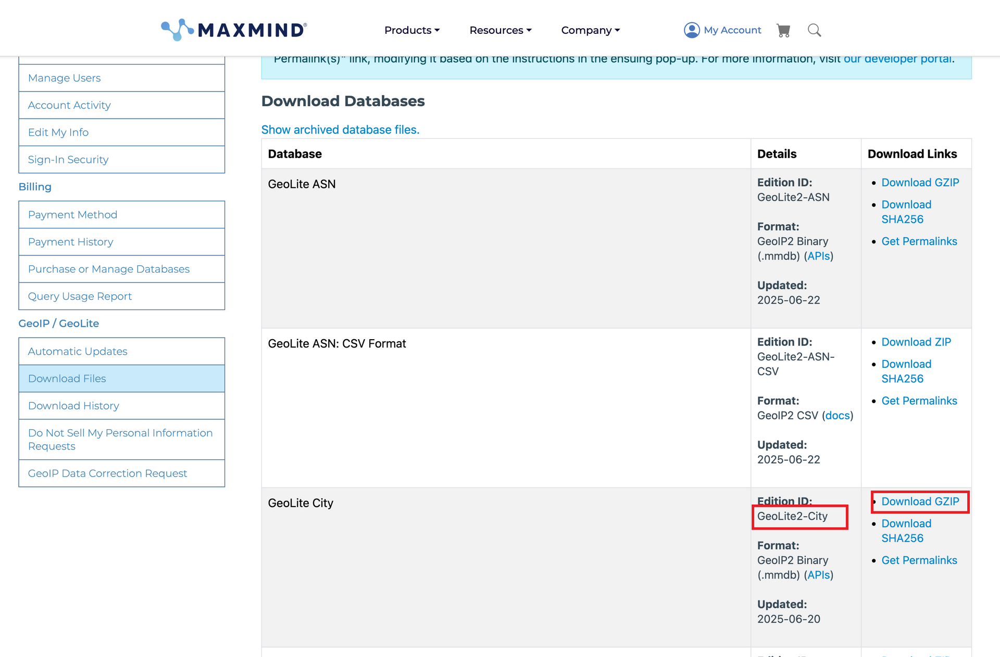
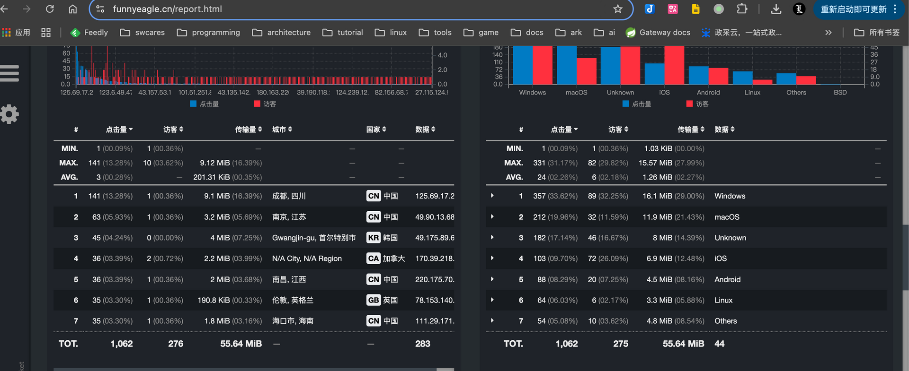

---

slug: "/goaccess-show-cn-and-location"

description: "GoAccess 是轻量级日志分析工具，支持实时解析 Nginx、Apache 等日志，生成交互式 HTML 报告，含访问统计、用户来源等可视化数据。本文主要介绍如何将goaccess设置为中文报告并显示访客地理位置。"
title: "goaccess设置为中文报告并显示访客地理位置"
date: 2025-06-23
summary: "GoAccess 是轻量级日志分析工具，支持实时解析 Nginx、Apache 等日志，生成交互式 HTML 报告，含访问统计、用户来源等可视化数据。本文主要介绍如何将goaccess设置为中文报告并显示访客地理位置。"
tags: ['coding']
draft: false
---


> 本文主要介绍如何将goaccess设置为中文报告并显示访客地理位置。
> 
> 
> 
> 本文内容基于 Ubuntu 22.04.5 LTS ，goaccess 1.9.4

GoAccess 是轻量级日志分析工具，支持实时解析 Nginx、Apache 等日志，生成交互式 HTML 报告，含访问统计、用户来源等可视化数据。

## 使goaccess生成的报告页面显示为中文

goaccess 1.3.x 版本开始支持中文，打开终端，输入`locale`查看当前系统语言设置.

```shell
# locale
LANG=zh_CN.UTF-8
```

如果当前系统语言不是中文，使用命令来安装中文语言包。

```shell
sudo apt-get install language-pack-zh-hans
```

安装完成后，将系统语言修改为中文

```shell
sudo update-locale LANG=zh_CN.UTF-8
```

修改完重启系统以生效。

## 使goaccess生成的报告显示地理位置

显示地理位置需要启用geoip，所以goaccess需要手动编译安装

```shell
$ sudo apt install libmaxminddb0 libmaxminddb-dev mmdb-bin  libncursesw5-dev
$ git clone https://github.com/allinurl/goaccess.git 
$ cd goaccess
$ autoreconf -fi
$ ./configure --enable-utf8 --enable-geoip=mmdb
$ make
$ make install
```

安装完成后，输入goaccess --version 查看一下版本，Build configure arguments: 需要有--enable-geoip=mmdb

```shell
$ goaccess --version
GoAccess - 1.9.4.
For more details visit: https://goaccess.io/
Copyright (C) 2009-2024 by Gerardo Orellana

Build configure arguments:
  --enable-utf8
  --enable-geoip=mmdb
```

到 maxmind.com下载 GeoLite2-City 的mmdb数据库文件，下载完解压，我下载下来是个`GeoLite2-City_20250620.tar.gz`，解压后在goaccess命令后面跟上GeoLite2-City.mmdb路径 `--geoip-database=/xxx/GeoLite2-City_20250620/GeoLite2-City.mmdb`



完整使用命令如下：

```shell
goaccess /var/log/nginx/access.log -o /var/www/html/report.html --log-format=COMBINED --geoip-database=/root/GeoLite2-City_20250620/GeoLite2-City.mmdb --ignore-crawlers
```

`--ignore-crawlers` 是忽略爬虫，可以不加。

使用效果

