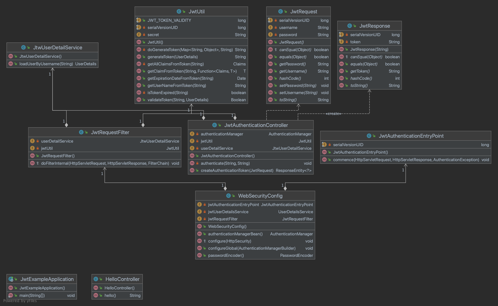
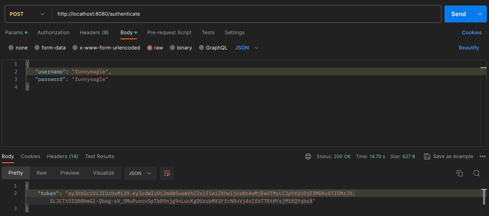
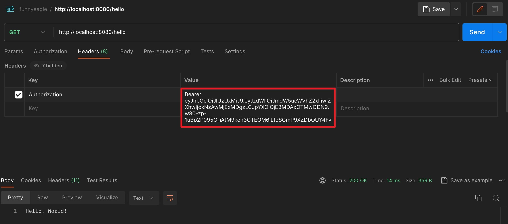

> 上一篇[【JWT】JSON Web Token 入门简介](http://www.funnyeagle.cn/Introduction-to-jwt/)中，我们了解了什么是 JWT 以及使用场景等。本示例项目中，我们会搭建一个`spring-boot` 应用，利用 `JWT` 身份验证来保护公开的 `REST API`。该项目没有使用数据库，用硬编码的用户名和密码进行用户身份验证。只有客户端发起携带有效的 `JSON Web Token` （JWT） 请求时，它才能使用此 API。

项目类图如下：


就这么几个类，下面直接开始吧！

#### 1、创建一个spring-boot项目，配置maven坐标，需要使用到 spring-boot-starter-web、spring-boot-starter-security 以及 jwt，为了简化代码，使用了lombok。

完整的pom.xml 如下：
```xml
<?xml version="1.0" encoding="UTF-8"?>
<project xmlns:xsi="http://www.w3.org/2001/XMLSchema-instance" xmlns="http://maven.apache.org/POM/4.0.0"
         xsi:schemaLocation="http://maven.apache.org/POM/4.0.0 https://maven.apache.org/xsd/maven-4.0.0.xsd">
    <modelVersion>4.0.0</modelVersion>
    <parent>
        <groupId>org.springframework.boot</groupId>
        <artifactId>spring-boot-starter-parent</artifactId>
        <version>2.5.0</version>
        <relativePath/> <!-- lookup parent from repository -->
    </parent>
    <groupId>cn.funnyealge</groupId>
    <artifactId>jwt-example</artifactId>
    <version>0.0.1-SNAPSHOT</version>
    <name>jwt-example</name>
    <description>Demo project for Spring Boot</description>
    <properties>
        <java.version>8</java.version>
    </properties>
    <dependencies>
        <dependency>
            <groupId>org.springframework.boot</groupId>
            <artifactId>spring-boot-starter</artifactId>
        </dependency>
        <dependency>
            <groupId>org.springframework.boot</groupId>
            <artifactId>spring-boot-starter-web</artifactId>
        </dependency>
        <dependency>
            <groupId>org.springframework.boot</groupId>
            <artifactId>spring-boot-starter-security</artifactId>
        </dependency>
        <dependency>
            <groupId>io.jsonwebtoken</groupId>
            <artifactId>jjwt</artifactId>
            <version>0.9.1</version>
        </dependency>
        <dependency>
            <groupId>org.projectlombok</groupId>
            <artifactId>lombok</artifactId>
            <optional>true</optional>
        </dependency>
        <dependency>
            <groupId>org.springframework.boot</groupId>
            <artifactId>spring-boot-starter-test</artifactId>
            <scope>test</scope>
        </dependency>
    </dependencies>

    <build>
        <plugins>
            <plugin>
                <groupId>org.springframework.boot</groupId>
                <artifactId>spring-boot-maven-plugin</artifactId>
                <configuration>
                    <image>
                        <builder>paketobuildpacks/builder-jammy-base:latest</builder>
                    </image>
                    <excludes>
                        <exclude>
                            <groupId>org.projectlombok</groupId>
                            <artifactId>lombok</artifactId>
                        </exclude>
                    </excludes>
                </configuration>
            </plugin>
        </plugins>
    </build>
    <repositories>
        <repository>
            <id>spring-milestones</id>
            <name>Spring Milestones</name>
            <url>https://repo.spring.io/milestone</url>
            <snapshots>
                <enabled>false</enabled>
            </snapshots>
        </repository>
        <repository>
            <id>spring-snapshots</id>
            <name>Spring Snapshots</name>
            <url>https://repo.spring.io/snapshot</url>
            <releases>
                <enabled>false</enabled>
            </releases>
        </repository>
    </repositories>
    <pluginRepositories>
        <pluginRepository>
            <id>spring-milestones</id>
            <name>Spring Milestones</name>
            <url>https://repo.spring.io/milestone</url>
            <snapshots>
                <enabled>false</enabled>
            </snapshots>
        </pluginRepository>
        <pluginRepository>
            <id>spring-snapshots</id>
            <name>Spring Snapshots</name>
            <url>https://repo.spring.io/snapshot</url>
            <releases>
                <enabled>false</enabled>
            </releases>
        </pluginRepository>
    </pluginRepositories>

</project>

```

#### 2、spring-boot工程搭建好之后，创建一个HelloController，写一个GET请求的 REST API `/hello`

```java
package cn.funnyealge.jwt.controller;

import org.springframework.web.bind.annotation.GetMapping;
import org.springframework.web.bind.annotation.RestController;

/**
 * @author yangjl
 * @description Hello Controller
 * @date 2023-11-15 10:43
 **/
@RestController
public class HelloController {

    @GetMapping("/hello")
    public String hello() {
        return "Hello, World!";
    }
}

```

此时启动项目的话，通过 `http://localhost:8080/hello` 可以直接访问到这个API的。

#### 3、接下来开始配置spring security 和 JWT。

3.1 创建`JwtUtil`类，用于创建、验证`JWT`以及获取`JWT`中的信息。

```java
package cn.funnyealge.jwt.config;

import io.jsonwebtoken.Claims;
import io.jsonwebtoken.Jwts;
import io.jsonwebtoken.SignatureAlgorithm;
import org.springframework.beans.factory.annotation.Value;
import org.springframework.security.core.userdetails.UserDetails;
import org.springframework.stereotype.Component;

import java.io.Serializable;
import java.util.Date;
import java.util.HashMap;
import java.util.Map;
import java.util.function.Function;

/**
 * @author yangjl
 * @description jwt util
 * @date 2023-11-15 11:21
 **/
@Component
public class JwtUtil implements Serializable {
    public static final long JWT_TOKEN_VALIDITY = 5 * 60 * 60;
    private static final long serialVersionUID = 1L;
    @Value("${jwt.secret}")
    private String secret;

    /**
     * 从token中获取username
     */
    public String getUserNameFromToken(String token) {
        return getClaimFromToken(token, Claims::getSubject);
    }

    /**
     * 从token中获取过期时间
     *
     * @param token
     * @return
     */
    public Date getExpirationDateFromToken(String token) {
        return getClaimFromToken(token, Claims::getExpiration);
    }

    public <T> T getClaimFromToken(String token, Function<Claims, T> claimsResolver) {
        Claims claims = getAllClaimsFromToken(token);
        return claimsResolver.apply(claims);
    }

    /**
     * 从token中获取信息
     *
     * @param token
     * @return
     */
    private Claims getAllClaimsFromToken(String token) {
        return Jwts.parser().setSigningKey(secret).parseClaimsJws(token).getBody();
    }

    /**
     * 检查token是否过期
     *
     * @param token
     * @return
     */
    private boolean isTokenExpired(String token) {
        Date expiration = getExpirationDateFromToken(token);
        return expiration.before(new Date());
    }


    public String generateToken(UserDetails userDetails) {
        Map<String, Object> claims = new HashMap<>(16);
        return doGenerateToken(claims, userDetails.getUsername());
    }

    /**
     * 使用Jwts生成Token
     *
     * @param claims
     * @param subject
     * @return
     */
    private String doGenerateToken(Map<String, Object> claims, String subject) {
        return Jwts.builder()
                .setClaims(claims)
                .setSubject(subject)
                .setIssuedAt(new Date(System.currentTimeMillis()))
                .setExpiration(new Date(System.currentTimeMillis() + JWT_TOKEN_VALIDITY * 1000))
                .signWith(SignatureAlgorithm.HS512, secret)
                .compact();
    }

    /**
     * 验证token
     *
     * @param token
     * @param userDetails
     * @return
     */
    public Boolean validateToken(String token, UserDetails userDetails) {
        String username = getUserNameFromToken(token);
        return username.equals(userDetails.getUsername()) && !isTokenExpired(token);
    }

}

```

3.2 创建`JWTUserDetailsService`类,实现了 spring security 的UserDetailsService 接口，重写loadUserByUsername方法，通过用户名获取用户详细信息，此处没有使用数据库，使用硬编码的方式定义了一个用户，实际应用中应该从数据库中查询用户信息。其中密码是经过`bcrypt`加密的，如果需要修改，搜一个在线Bcrypt密码生成工具生成替换一下就可以。

```java
package cn.funnyealge.jwt.service;

import org.springframework.security.core.userdetails.User;
import org.springframework.security.core.userdetails.UserDetails;
import org.springframework.security.core.userdetails.UserDetailsService;
import org.springframework.security.core.userdetails.UsernameNotFoundException;
import org.springframework.stereotype.Service;

import java.util.ArrayList;

/**
 * @author yangjl
 * @description
 * @date 2023-11-15 13:34
 **/
@Service
public class JtwUserDetailService implements UserDetailsService {
    @Override
    public UserDetails loadUserByUsername(String username) throws UsernameNotFoundException {
        if ("funnyeagle".equals(username)) {
            return new User("funnyeagle", "$2a$10$JQEWsaUWgp6zYk1cvLvHMuM6kcLbmAdWPrp9QCSNYswu.kFum9PIq", new ArrayList<>());
        }

        throw new UsernameNotFoundException("User not found with username:" + username);
    }
}

```

3.3 创建`JwtRequest`类，包含用户名和密码，客户端向服务端发送请求时使用。

```java
package cn.funnyealge.jwt.model;

import lombok.Data;

import java.io.Serializable;

/**
 * @author yangjl
 * @description
 * @date 2023-11-15 13:50
 **/
@Data
public class JwtRequest implements Serializable {
    private static final long serialVersionUID = 1L;

    private String username;
    private String password;
}
```

3.4 创建`JwtResponse`类，包含token属性，用于向客户端返回数据

```java
package cn.funnyealge.jwt.model;

import lombok.Data;

import java.io.Serializable;

/**
 * @author yangjl
 * @description
 * @date 2023-11-15 13:52
 **/
@Data
public class JwtResponse implements Serializable {
    private static final long serialVersionUID = 1L;

    private final String token;

    public JwtResponse(String token) {
        this.token = token;
    }
}

```

3.5 创建`JwtAuthenticationController`类，包含一个POST `/authenticate` API，调用`AuthenticationManager`的`authenticate()`方法对用户名和密码进行验证，验证通过则使用JwtUtil创建JWT token返回给客户端。

```java
package cn.funnyealge.jwt.controller;

import cn.funnyealge.jwt.config.JwtUtil;
import cn.funnyealge.jwt.model.JwtRequest;
import cn.funnyealge.jwt.model.JwtResponse;
import cn.funnyealge.jwt.service.JtwUserDetailService;
import org.springframework.http.ResponseEntity;
import org.springframework.security.authentication.AuthenticationManager;
import org.springframework.security.authentication.BadCredentialsException;
import org.springframework.security.authentication.DisabledException;
import org.springframework.security.authentication.UsernamePasswordAuthenticationToken;
import org.springframework.security.core.userdetails.UserDetails;
import org.springframework.web.bind.annotation.CrossOrigin;
import org.springframework.web.bind.annotation.PostMapping;
import org.springframework.web.bind.annotation.RequestBody;
import org.springframework.web.bind.annotation.RestController;

import javax.annotation.Resource;

/**
 * @author yangjl
 * @description
 * @date 2023-11-15 13:43
 **/
@RestController
@CrossOrigin
public class JwtAuthenticationController {

    @Resource
    private AuthenticationManager authenticationManager;

    @Resource
    private JwtUtil jwtUtil;

    @Resource
    private JtwUserDetailService userDetailService;

    @PostMapping(value = "/authenticate")
    public ResponseEntity<?> createAuthenticationToken(@RequestBody JwtRequest authenticationRequest) throws Exception {
        authenticate(authenticationRequest.getUsername(), authenticationRequest.getPassword());
        UserDetails userDetails = userDetailService.loadUserByUsername(authenticationRequest.getUsername());
        String token = jwtUtil.generateToken(userDetails);
        return ResponseEntity.ok(new JwtResponse(token));
    }

    private void authenticate(String username, String password) throws Exception {
        try {
            authenticationManager.authenticate(new UsernamePasswordAuthenticationToken(username, password));
        } catch (DisabledException e) {
            throw new Exception("user disabled", e);
        } catch (BadCredentialsException e) {
            throw new Exception("invalid credentials", e);
        }
    }
}

```

3.6 创建`JwtRequestFilter`类，继承自spring的OncePerRequestFilter类，任何请求过来都会执行这个Filter，用来检查token的有效性，验证通过后，将用户信息设置到security的上下文中。
```java
package cn.funnyealge.jwt.config;

import cn.funnyealge.jwt.service.JtwUserDetailService;
import io.jsonwebtoken.ExpiredJwtException;
import org.springframework.security.authentication.UsernamePasswordAuthenticationToken;
import org.springframework.security.core.context.SecurityContextHolder;
import org.springframework.security.core.userdetails.UserDetails;
import org.springframework.security.web.authentication.WebAuthenticationDetailsSource;
import org.springframework.stereotype.Component;
import org.springframework.web.filter.OncePerRequestFilter;

import javax.annotation.Resource;
import javax.servlet.FilterChain;
import javax.servlet.ServletException;
import javax.servlet.http.HttpServletRequest;
import javax.servlet.http.HttpServletResponse;
import java.io.IOException;

/**
 * JwtRequestFilter 继承了 Spring Web Filter OncePerRequestFilter 类。
 * 对于任何传入请求，都会执行此 Filter 类。它检查请求是否具有有效的 JWT 令牌。
 * 如果它具有有效的 JWT 令牌，则它会在上下文中设置身份验证，以指定当前用户已通过身份验证。
 *
 * @author yangjl
 * @description
 * @date 2023-11-15 13:54
 **/
@Component
public class JwtRequestFilter extends OncePerRequestFilter {

    @Resource
    private JtwUserDetailService userDetailService;

    @Resource
    private JwtUtil jwtUtil;


    @Override
    protected void doFilterInternal(HttpServletRequest request, HttpServletResponse response, FilterChain chain) throws ServletException, IOException {
        final String requestTokenHeader = request.getHeader("Authorization");

        String username = null;
        String jwtToken = null;
        if (requestTokenHeader != null && requestTokenHeader.startsWith("Bearer ")) {
            jwtToken = requestTokenHeader.substring(7);
            try {
                username = jwtUtil.getUserNameFromToken(jwtToken);
            } catch (IllegalArgumentException e) {
                System.out.println("Unable to get JWT Token");
            } catch (ExpiredJwtException e) {
                System.out.println("JWT Token has expired");
            }
        } else {
            logger.warn("JWT Token does not begin with Bearer String");
        }

        if (username != null && SecurityContextHolder.getContext().getAuthentication() == null) {

            UserDetails userDetails = this.userDetailService.loadUserByUsername(username);

            if (jwtUtil.validateToken(jwtToken, userDetails)) {

                UsernamePasswordAuthenticationToken usernamePasswordAuthenticationToken = new UsernamePasswordAuthenticationToken(
                        userDetails, null, userDetails.getAuthorities());
                usernamePasswordAuthenticationToken
                        .setDetails(new WebAuthenticationDetailsSource().buildDetails(request));
                SecurityContextHolder.getContext().setAuthentication(usernamePasswordAuthenticationToken);
            }
        }
        chain.doFilter(request, response);
    }
}

```

3.7 创建`JwtAuthenticationEntryPoint`类，继承spring的`AuthenticationEntryPoint`类，重写`commence`方法，用于拒绝未经身份验证的请求并返回错误码401。

```java
package cn.funnyealge.jwt.config;

import org.springframework.security.core.AuthenticationException;
import org.springframework.security.web.AuthenticationEntryPoint;
import org.springframework.stereotype.Component;

import javax.servlet.http.HttpServletRequest;
import javax.servlet.http.HttpServletResponse;
import java.io.IOException;
import java.io.Serializable;

/**
 * 此类继承 Spring 的 AuthenticationEntryPoint 类，拒绝未经身份验证的请求并返回错误代码 401
 *
 * @author yangjl
 * @description
 * @date 2023-11-15 14:02
 **/
@Component
public class JwtAuthenticationEntryPoint implements AuthenticationEntryPoint, Serializable {

    private static final long serialVersionUID = -1L;

    @Override
    public void commence(HttpServletRequest request, HttpServletResponse response,
                         AuthenticationException authException) throws IOException {

        response.sendError(HttpServletResponse.SC_UNAUTHORIZED, "Unauthorized");
    }
}
```
3.8 创建`WebSecurityConfig`类， 配置 AuthenticationManager，BCryptPasswordEncoder 和验证配置。

```java
package cn.funnyealge.jwt.config;

import org.springframework.beans.factory.annotation.Autowired;
import org.springframework.context.annotation.Bean;
import org.springframework.context.annotation.Configuration;
import org.springframework.security.authentication.AuthenticationManager;
import org.springframework.security.config.annotation.authentication.builders.AuthenticationManagerBuilder;
import org.springframework.security.config.annotation.method.configuration.EnableGlobalMethodSecurity;
import org.springframework.security.config.annotation.web.builders.HttpSecurity;
import org.springframework.security.config.annotation.web.configuration.EnableWebSecurity;
import org.springframework.security.config.annotation.web.configuration.WebSecurityConfigurerAdapter;
import org.springframework.security.config.http.SessionCreationPolicy;
import org.springframework.security.core.userdetails.UserDetailsService;
import org.springframework.security.crypto.bcrypt.BCryptPasswordEncoder;
import org.springframework.security.crypto.password.PasswordEncoder;
import org.springframework.security.web.authentication.UsernamePasswordAuthenticationFilter;

/**
 * @author yangjl
 * @description
 * @date 2023-11-15 14:21
 **/
@Configuration
@EnableWebSecurity
@EnableGlobalMethodSecurity(prePostEnabled = true)
public class WebSecurityConfig extends WebSecurityConfigurerAdapter {

    @Autowired
    private JwtAuthenticationEntryPoint jwtAuthenticationEntryPoint;

    @Autowired
    private UserDetailsService jwtUserDetailsService;

    @Autowired
    private JwtRequestFilter jwtRequestFilter;

    @Autowired
    public void configureGlobal(AuthenticationManagerBuilder auth) throws Exception {
        auth.userDetailsService(jwtUserDetailsService).passwordEncoder(passwordEncoder());
    }

    @Bean
    public PasswordEncoder passwordEncoder() {
        return new BCryptPasswordEncoder();
    }

    @Bean
    @Override
    public AuthenticationManager authenticationManagerBean() throws Exception {
        return super.authenticationManagerBean();
    }

    @Override
    protected void configure(HttpSecurity httpSecurity) throws Exception {
        httpSecurity.csrf().disable()
                // 放行 /authenticate
                .authorizeRequests().antMatchers("/authenticate").permitAll().
                // 其它任何请求都需要认证
                anyRequest().authenticated().and().
                // 使用无状态session
                exceptionHandling().authenticationEntryPoint(jwtAuthenticationEntryPoint).and().sessionManagement()
                .sessionCreationPolicy(SessionCreationPolicy.STATELESS);

        // 所有请求都要通过filter来验证token
        httpSecurity.addFilterBefore(jwtRequestFilter, UsernamePasswordAuthenticationFilter.class);
    }
}

```

启动项目，使用postman请求`/authenticate`接口



> TIP: 如果`/authenticate`接口抛出异常 `ClassNotFoundException: javax.xml.bind.DatatypeConverter`，将JDK版本修改为8即可。


获取到token之后，在/hello请求的Header中添加 Authorization，Value的格式为 `Bearer TOKEN` Bearer后面有个空格。如图。


完整项目源码：https://github.com/funny-eagle/jwt-example

（完）