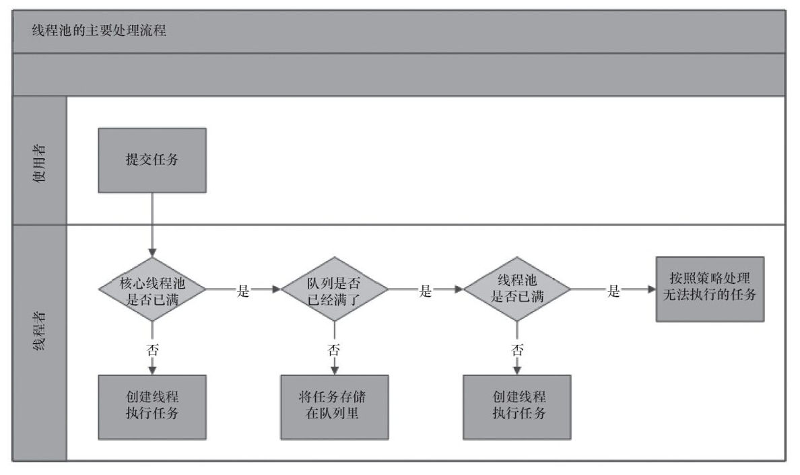
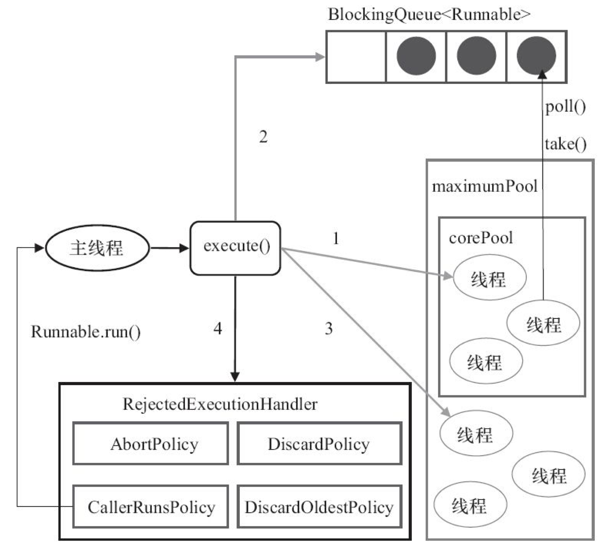

---

slug: "/multi-thread-notes"

description: "Java线程和线程池基础知识。"
title: Java 多线程
date: "2018-04-07 23:11:04"
summary: "Java线程和线程池基础知识。"
tags: ['coding']

---

Java的重要功能之一就是内部支持多线程-在一个程序中允许同时运行多个任务。

## 线程的概念
> **线程**是指一个任务从头到尾的执行流程。

一个Java程序中可以并发的启动多个线程，这些线程可以在多个处理器上同时运行。

多线程可以使程序反应更快，交互性更强，执行效率更高，即使再单核处理器的系统上，多线程程序的运行速度也比单线程速度更快。

在单处理器系统中，多个线程共享CPU时间，称为时间分享，操作系统负责调度及分配资源给它们。CPU分配给线程的时间称为时间片，一般是几十ms，获得时间片的线程会被CPU切换执行。

在Java中，每个任务都是`Runnable`接口的一个实例，也成为`可运行对象（runnable object）`。

## 创建任务和线程

一个任务类必须实现Runnable接口。然后通过线程来执行任务。
任务就是对象。为了创建任务，必须首先为任务定义一个实现Runnable接口的类。


```java
// 通过实现Runnable接口定义一个任务类
public class TaskClass implements Runnable{
	public TaskClass(){
	
	}
	
	public void run(){
		// do something...
	}
}
```

```java
// 创建一个任务、一个线程以及启动线程的步骤
public class Client{
	public void someMethod(){
		//  创建一个TaskClass实例
		TaskClass task = new TaskClass();
		// 创建一个线程
		Thread thread = new Thread(task);
		// 启动线程
		thread.start();
	}
}

```

### 实战

> 创建三个任务，然后创建三个线程，运行这些任务:
> 
> 第一个任务打印字母a100次
> 
> 第二个任务打印字母b100次
> 
> 第三个任务打印1到100的整数

```java
package org.nocoder.thread;

/**
 * 创建三个任务以及三个运行这些任务的线程:
 * 第一个任务打印字母a100次
 * 第二个任务打印字母b100次
 * 第三个任务打印1到100的整数
 *
 * @author jason
 * @date 18/4/3.
 */
public class TaskThreadDemo {
    public static void main(String[] args){
        // 创建任务类
        Runnable printA = new PrintChar('a', 100);
        Runnable printB = new PrintChar('b', 100);
        Runnable print100 = new PrintNumber(100);
        // 创建线程
        Thread threadPrintA = new Thread(printA);
        Thread threadPrintB = new Thread(printB);
        Thread threadPrint100 = new Thread(print100);
        // 启动线程
        threadPrintA.start();
        threadPrintB.start();
        threadPrint100.start();
    }

}

/**
 * 打印字符任务类
 */
class PrintChar implements Runnable {
    /**
     * 需要打印的字符
     */
    private char charToPrint;

    /**
     * 需要打印的次数
     */
    private int times;

    public PrintChar(char c, int t) {
        charToPrint = c;
        times = t;
    }

    public void run() {
        for (int i = 0; i < times; i++) {
            System.out.print(charToPrint);
        }
    }
}

/**
 * 打印数字任务类
 */
class PrintNumber implements Runnable {
    /**
     * 需要打印的最大值
     */
    private int lastNum;

    public PrintNumber(int n) {
        lastNum = n;
    }

    public void run() {
        for (int i = 1; i <= lastNum; i++) {
            System.out.print(" " + i);
        }
    }


}
```

> 任务中的run()方法指名如何完成这个任务，Java虚拟机通过调用任务的run()方法执行任务，无需程序员特意调用，直接调用run()方法只是在同一个线程中执行该方法，而没有新线程被启动。

## Thread类
Thread类包含为任务而创建的线程的构造方法，以及控制线程的方法。

Thread类实现了Runnable接口，所以可以定一个Thread的扩展类，实现Runnable的run()方法，然后客户端类创建这个类的一个对象，调用start()启动线程。

```java
package org.nocoder.thread;

/**
 * @author jason
 * @date 18/4/3.
 */
public class CustomeThread extends Thread {
    public CustomeThread(){

    }

    public void run(){
        System.out.println(Thread.currentThread().getName() + ": do something...");
    }
}

class Client{
    public static void main(String[] args){
        Thread thread1 = new CustomeThread();
        thread1.setName("线程1");
        thread1.start();

        Thread thread2 = new CustomeThread();
        thread2.setName("线程2");
        thread2.start();
    }

}

```

使用`yield()`方法为其他线程临时让出CPU时间。

```java
Thread.yield();
```

使用`sleep(long mills)`可以将该线程设置为休眠以确保其他线程的执行，休眠时间为指定的毫秒数。

```java
// 休眠 1ms
try{
	...
	Thread.sleep(1);
}catch(InterruptedException ex){
	// do someting...
}
```
`Thread.sleep()`方法可能抛出一个`InterruptedException`，这是一个必检异常。当一个休眠线程的interrupt()方法被调用时，就会发生这样的一个异常。

使用`join()`方法使用一个线程等待另一个线程的结束。

```java
package org.nocoder.thread;

/**
 * @author jason
 * @date 18/4/6.
 */
public class YieldTest {
    public static void main(String[] args) {
        Thread t = new Thread(new Runnable() {
            public void run() {
                for (int i = 1; i <= 10; i++) {
                    System.out.print(i + " ");
                }
                System.out.println();
            }
        });
        t.start();
        try {
        	  // 调用线程t的join()方法，其他线程要等待这个线程执行结束后才会执行
            t.join();
        } catch (InterruptedException e) {
            e.printStackTrace();
        }
        for (int j = 11; j <= 20; j++) {
            System.out.print(j + " ");
        }
        System.out.println();
    }
}

```

输出结果：

```
1 2 3 4 5 6 7 8 9 10 
11 12 13 14 15 16 17 18 19 20 

```

如果不加join()方法的输出结果顺序不固定

```
11 12 13 14 15 16 17 1 2 3 4 5 6 7 8 9 10 
18 19 20 
```

## 线程池

### 使用线程池的好处

几乎所有需要异步或者并发执行任务的程序都可以使用线程池，合理的使用线程池有以下几个好处。

- 降低资源消耗。通过重复利用已创建的线程，降低线程创建和销毁造成的消耗。
- 提高相应速度。当任务到达时，任务可以不需要等到线程创建就能立即执行。
- 提高线程的可管理性。线程时稀缺资源，如果无限制的创建，不仅会消耗系统资源，而且还会降低系统的稳定性，使用线程池可以进行统一分配、调优和监控。

###  线程池的实现原理

先来看看线程池的主要处理流程



从上图可以看出，使用者提交一个任务后，线程池的处理流程如下：

1. 判断核心线程池是否已满，如果没有满，则创建一个新的线程执行任务。如果满了，则进入下个流程。
2. 判断队列是否已满，如果没有满，将任务加入到队列中。如果满了，进入下个流程。
3. 判断线程池是否已满，如果没有满，则创建一个新的线程执行任务。如果满了，进入下个流程。
4. 按照策略处理无法执行的任务。


ThreadPoolExecutor执行示意图



1. 如果当前运行的线程数小于corePoolSize，则创建新的线程来执行任务（执行这一步骤需要获取全局锁）
2. 如果运行的线程数等于或者大于corePoolSize，则将任务加入BlockingQueue
3. 如果无法将任务加入BlockingQueue，则创建新的线程来处理任务，并调用RejectedExceptionHandler.rejectedExecution()方法

**工作线程**：线程池创建线程时，会将线程封装成工作线程Worker，Worker在执行完任务后，还会循环获取工作队列里的任务来执行。

线程池中的线程执行任务分两种情况：

1. 在execute() 方法中创建一个线程时，会让这个线程执行当前任务。
2. 这个线程执行完上一任务后，会反复从BlockingQueue中获取任务来执行。

### 线程池的使用

通过ThreadPoolExecutor来创建一个线程池。

创建一个线程池需要的几个参数：

1. corePoolSize 核心线程数量
2. maxPoolSize 线程池最大数量
3. runnableTaskQueue 任务队列
   1. ArrayBlockingQueue 基于数组结构的有界阻塞队列
   2. LinkedBlockingQueue 基于链表结构的阻塞队列
   3. SynchronousQueue  不存储元素的阻塞队列
   4. PriorityBlockingQueue 具有优先级的无线阻塞队列
4. ThreadFactory 创建线程的工厂，使用guava提供的ThreadFactoryBuilder给线程设置有意义的名字
5. RejectedExceptionHandler 当队列和线程池都满了，线程池无法执行新任务时的处理策略
   1. AbortPolicy 直接抛异常
   2. CallerRunsPolicy 使用调用者所属的线程来运行
   3. DiscardOldestPolicy 抛弃队列里的最近一个任务，执行当前任务
   4. DiscardPolicy 直接抛弃，不处理
6. keepAliveTime 线程活动保持时间
7. TimeUnit 线程活动保持时间的单位


创建线程池示例：

```java
public ExecutorService getExecutorService() {
    ThreadFactory threadFactory = new ThreadFactoryBuilder().build();
    ExecutorService executorService = new ThreadPoolExecutor(
      corePoolSize, maxPoolSize, 20000L,
      TimeUnit.MILLISECONDS, new LinkedBlockingDeque<>(2500),
      threadFactory, new ThreadPoolExecutor.CallerRunsPolicy());
    return executorService;
}
```

### 提交任务到线程池

- execute() 用于提交不需要返回值的任务

  ```java
  executorService.execute(()->{
    // do something
  });
  ```

- submit() 用于提交需要返回值的任务，任务需要实现Callable 接口，返回值为Future，可以通过future.get()获取返回值，get()方法会阻塞当前线程直到任务完成

  ```java
  Future future = executorService.submit(new CallableTask());
  try {
    Object o = future.get();
  } catch (InterruptedException e) {
    e.printStackTrace();
  } catch (ExecutionException e) {
    e.printStackTrace();
  }
  ```

## 参考文献

- 《Java并发编程的艺术》

