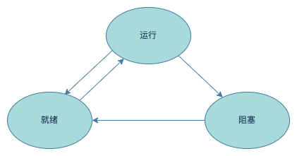
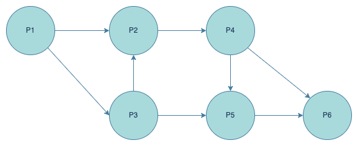

## 一、操作系统

**操作系统**是一种大型、复杂的软件，通常由操作系统内核和其他许多附加的配套软件所组成。操作系统内核是指能够提供进程管理、存储管理、设备管理和文件管理等功能的那些软件模块，它们是操作系统中最基本的部分，为众多应用程序访问计算机硬件提供服务。

### 操作系统的作用：

（1）管理计算机中运行的程序和分配各种软硬件资源

（2）为用户提供友善的人机界面

（3）为应用程序的开发和运行提供一个高效率的平台

（4）辅导用户操作、处理软硬件错误、监控系统性能、保护系统安全等

### 操作系统的特征：

（1）并发性：单CPU环境下，宏观上同时运行，微观上交替、轮流执行；多CPU环境下，可实现多个程序分配到不同的CPU上并行运行。

（2）共享性：资源（包括硬件资源和信息资源）可以被多个并发执行的进程共同使用，而不是被一个进程所独占。

（3）虚拟性：物理实体和逻辑对应物；目的是为用户提供易于使用且方便高效的操作环境。

（4）不确定性：并发执行导致进程何时执行、何时暂定、需要花多少时间执行，这些都是不可预知的

### 操作系统的分类

（1）批处理操作系统：分为单道批处理和多道批处理。单道是指一次只有一个作业装入内存执行。多道指操作系统允许多个作业装入内存执行。多道批处理系统的3个特点：多道、宏观上并行运行和微观上串行运行。

（2）分时操作系统：将CPU的工作时间划分为许多很短的时间片，轮流为各个终端的用户服务。分时操作系统的4个特点：多路行、独立性、交互性和及时性。

（3）实时操作系统：实时是指计算机对于外来信息能够以足够快的速度进行处理，并在被控制对象允许的时间范围内做出快速反应。实时系统对交互能力要求不高，但要求可靠性有保障。分为实时控制系统和实时信息处理系统。

（4）网络操作系统：是使联网计算机能方便而有效的共享网络资源，为网络用户提供各种服务的软件和有关协议的集合。功能包括：高效可靠的网络通信；网络共享资源管理；提供电子邮件、文件传输、共享硬盘和打印机等服务；网络安全管理；提供互操作能力。

（5）分布式操作系统：由多个分散的计算机经连接而成的计算机系统，系统中的计算机无主次之分，任意两台计算机可以通过通信交换信息。

（6）微型计算机操作系统：简称微机操作系统，常用的有Windows、MacOS和Linux。

（7）嵌入式操作系统：运行在嵌入式智能设备环境中，特点有：微型化、可定制、实时性、可靠性和易移植性。

## 二、进程管理

### 进程

进程由程序、数据集合、PCB（进程控制块）组成。PCB是一种数据结构，是进程存在的唯一标识。

进程的三种状态：运行态、就绪态、阻塞态。

- 运行态：一个进程在处理机上运行时；
- 就绪态：一个进程获得了除处理机以外的一切资源，一旦得到处理机就可以运行；
- 阻塞态：一个进程正在等待某一事件发生而暂时停止运行，此时即使得到处理机也无法运行。

进程的三态模型

PCB（进程控制块）的三种组织方式：
- 线性方式：把所有的PCB组织在一张线性表中，每次查找时需要扫描全表，不论进程的状态如何，都将所有的PCB连续的存放在内存的系统区，适用于系统中进程数据较少的情况。
- 链接方式：通过链表的方式把相同状态的PCB连接起来。
- 索引方式：按进程的状态分为不同的索引表，把相同状态的进程归入同一个索引表中。

### 前趋图

前趋图(Precedence Graph)是一个有向无环图，记作`->={(Pi, Pj) | Pi必须在Pj之前开始}`，由节点和有向边组成，节点代表各程序段的操作，节点间的有向边表示两个程序段操作之间存在的前趋关系。

前趋图可以用来表示多个程序或进程的执行顺序。

### 进程的通信

进程的互斥是指系统中多个进程因争用临界资源而互斥执行，其中临界资源指的是一次只能供一个进程使用的资源。例如两个进程A和B都需要使用打印机，进程A正在使用打印机，进程B尝试获取资源，此时进程B被阻塞，等待进程A释放资源。

进程的同步表现为多个进程协作，顺序执行。例如例如两个进程A和B，假设进程B依赖进程A的执行结果，当进程A执行时，进程B为阻塞状态，进程A执行完后，进程B被唤醒开始执行。

PV操作：实现进程之间互斥。
P操作表示阻塞操作，将信号量S的值减1，S = S - 1。
V操作表示唤醒操作，将信号量S的值加1，S = S + 1。

## 三、存储管理

存储管理的主要目的是解决多个程序使用内存的问题。存储管理方案包括分区存储管理、分页存储管理、分段存储管理、段页存储管理和虚拟存储管理。

**分区存储管理**把内存的用户区划分为若干个连续的区域，每个区域分配给一个程序使用，并限定只能在此区域运行。

**分页存储管理**是将一个进程的地址空间划分为若干个大小相等的区域，称之为`页`，将内存空间划分为与页相同大小的若干个物理块，称之为`块`。

- 页号和块号的对应关系表为页表
- 逻辑地址由页号和页内地址组成
- 物理地址由块号和块内地址组成
- 逻辑地址转换为物理地址时，根据页号查找块号，页内地址等于块内地址

**分段存储管理**

分段存储管理为每一个段分配一个连续的分区，而进程中的各个段可以离散的分配到内存的不同分区中，为每个进程建立一个段映射表（段表），进程执行时通过查询段表找到每个段所对应的内存分区。

**段页存储管理**

段页存储管理中，地址结构由段号、段内页号和页内地址组成。将整个内存划分为大小相等的物理块，将程序按逻辑关系分为若干个段，再将每个段划分为若干页，以物理块为单位离散分配。

**虚拟存储管理**

虚拟存储是将外存虚拟为内存的方式，使用磁盘来虚拟内存。

## 四、设备管理

设备管理的主要目标是提高设备的利用率，为用户提供方便、统一的界面。提高设备的利用率，就是提高CPU与I/O设备之间的并行操作程度。设备管理主要技术有：中断技术、DMA技术、通道技术和缓冲技术。

**中断技术**

中断技术是一种使CPU中止正在执行的程序而转去处理特殊事件的操作。

**磁盘调度**

系统在每一时刻只允许一个进程对磁盘进行I/O操作，其它进程等待。操作系统采用适合的磁盘调度算法使各进程对磁盘的寻道时间最短。

磁盘调度分为**移臂调度**和**旋转调度**，先进行移臂调度，再进行旋转调度。移臂调度寻找磁道，旋转调度寻找扇区。

spindle：主轴
disk：磁盘
saved file：数据（保存在扇区内）
read/write head：读写头(磁头)
arm：磁臂

## 五、文件管理

文件是具有符号名的、在逻辑上具有完整意义的一组相关信息项的集合。

### 文件的结构和组织

文件的结构是指文件的组织形式，分为逻辑结构和物理结构。逻辑结构是从用户角度看到的文件组织形式；物理结构是文件的内部组织形式，即文件在物理存储设备上的存放方法。

文件索引

- 直接索引：直接指向一个存储数据的磁盘块。
- 一级间接索引：指向一个内容全部都是直接地址索引的磁盘块。
- 二级间接索引：指向一个包含一级间接索引的磁盘块，每个一级间接索引再指向一个包含直接索引的磁盘块。

### 文件的存取方法

文件的存取方法是指读/写文件存储器上的一个物理块的方法。通常有顺序存取和随机存取两种方法。顺序存取是对文件中的信息按顺序一次进行读/写；随机存取是对文件中的信息可以按任意的次序随机读/写。

### 文件存储空间的管理

常用的空闲空间管理方法有空闲区表、位示图（Bitmap）、空闲块链和成组链接法。

