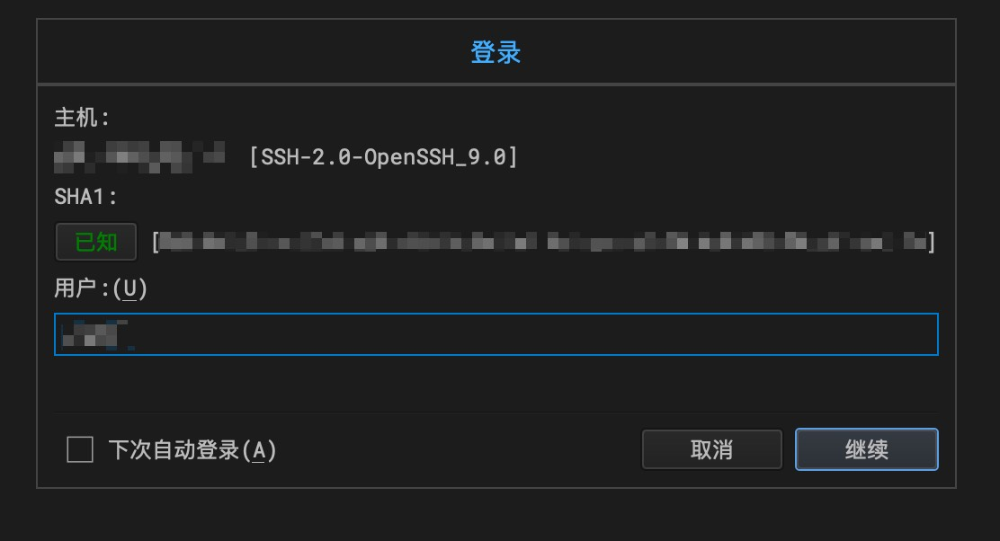
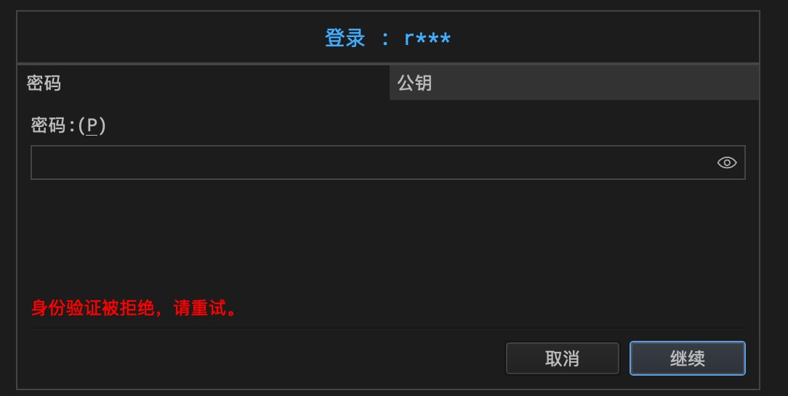
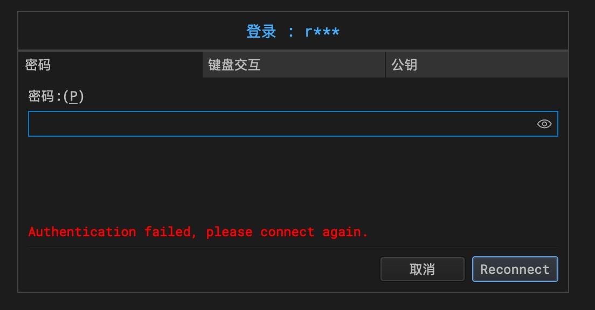
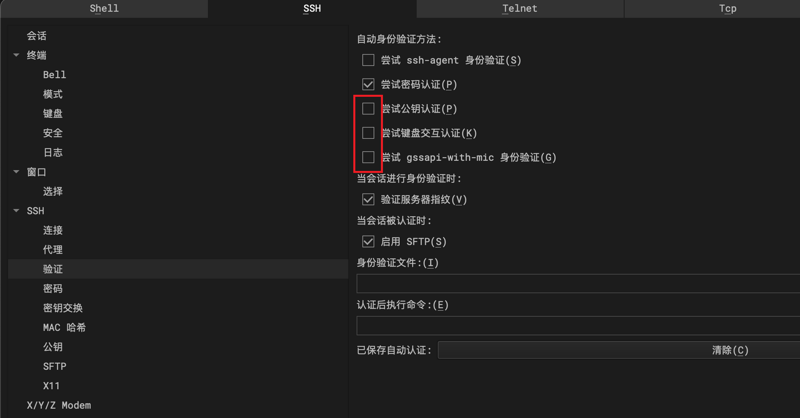

## 问题描述

WindTerm2.5.0，使用`SSH`用户名和密码方式登录Linux服务器。新建会话，输入IP和端口后，到输入用户名界面，输入用户名后，提示”身份验证被拒绝，请重试“，然后软件假死卡住，30秒到1分钟后又弹出身份验证失败请重试，输入密码后又跳转到登录界面，继续输入用户名，又会假死。。。

## 解决办法

在会话的IP上右键->属性->验证，取消`勾选尝试公钥认`、`尝试键盘交互认`、`尝试gssapi-with-mic身份验证`，保存。

然后重新登录就可以了。。。

`WindTerm`开源免费又好用，有点儿小BUG能接受，希望后续版本能解决。

Game Over